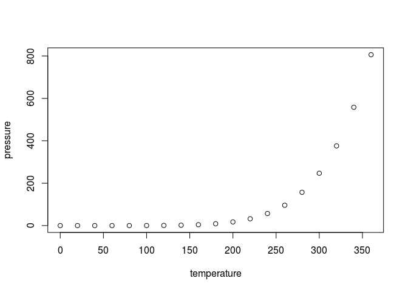

#  Understanding the relationship between Education and GDP.
Gino Varghese  
October 25, 2016  

## Introdution
<br>     

#### For this analysis we will look at two different data sets      

* First set of data contains Gross Domestic Product which is comprised of 2012 GDP values for 190 countries throughout the world. More recent data is hosted on Worldbank.org.     
    + http://data.worldbank.org/data-catalog/GDP-ranking-table
* Second contains World Bank Education Stats data.       
    + http://data.worldbank.org/data-catalog/ed-stats
<br>

Our goal is to make some educated assumptions by combining both the data sets, to see if there is any relationship between the access to education, progression, completion, literacy, teachers, population, and expenditures to a givens countries economic growth.

The indicators cover the education cycle from pre-primary to vocational and tertiary education.
together after tidying the raw files      

<br>
<br>

#### Before we start our analysis, we set the following:                

* set working directory          
* install necessary packages       
* R version     


```r
knitr::opts_chunk$set(echo = TRUE)
knitr::opts_knit$set(root.dir = "~/git/MSDS6306/CaseStudy01/Analysis/Data")
require(knitr)
require(dplyr)
require(plyr)
require(ggplot2)
require(downloader)
require(countrycode)
sessionInfo()
```

```
## R version 3.2.3 (2015-12-10)
## Platform: x86_64-pc-linux-gnu (64-bit)
## Running under: Ubuntu 16.04.1 LTS
## 
## locale:
##  [1] LC_CTYPE=en_US.UTF-8       LC_NUMERIC=C              
##  [3] LC_TIME=en_US.UTF-8        LC_COLLATE=en_US.UTF-8    
##  [5] LC_MONETARY=en_US.UTF-8    LC_MESSAGES=en_US.UTF-8   
##  [7] LC_PAPER=en_US.UTF-8       LC_NAME=C                 
##  [9] LC_ADDRESS=C               LC_TELEPHONE=C            
## [11] LC_MEASUREMENT=en_US.UTF-8 LC_IDENTIFICATION=C       
## 
## attached base packages:
## [1] stats     graphics  grDevices utils     datasets  methods   base     
## 
## other attached packages:
## [1] countrycode_0.18 downloader_0.4   ggplot2_2.1.0    plyr_1.8.4      
## [5] dplyr_0.5.0      knitr_1.14      
## 
## loaded via a namespace (and not attached):
##  [1] Rcpp_0.12.7      digest_0.6.10    assertthat_0.1   grid_3.2.3      
##  [5] R6_2.2.0         gtable_0.2.0     DBI_0.5-1        formatR_1.4     
##  [9] magrittr_1.5     scales_0.4.0     evaluate_0.10    stringi_1.1.2   
## [13] rmarkdown_1.1    tools_3.2.3      stringr_1.1.0    munsell_0.4.3   
## [17] yaml_2.1.13      colorspace_1.2-7 htmltools_0.3.5  tibble_1.2
```

<br>
<br>

#### Now to start our analysis we need to first download the data sets        

* **Gross Domestic Product download**         
    + This process downloads Gross Domestic Product data sets and renames it as "GDPbyCountry.csv"     
    + Downloaded file are listed below in Data directory        

```r
source("downloadGDP.R", echo = TRUE)
```

```
## 
## > gdpurl <- "https://d396qusza40orc.cloudfront.net/getdata%2Fdata%2FGDP.csv"
## 
## > download.file(gdpurl, destfile = "GDPbyCountry.csv", 
## +     quiet = TRUE)
```

```r
list.files()
```

```
## [1] "Cleanup_EDU.R"    "Cleanup_GDP.R"    "downloadEDU.R"   
## [4] "downloadGDP.R"    "GDPbyCountry.csv" "removeObjects.R"
```

<br>        

* **Education data download**      
    + This process downloads Education data set and renames it as "EDUbyCountry.csv"          
    + Downloaded file are listed below  in Data directory         

```r
source("downloadEDU.R", echo = TRUE)
```

```
## 
## > eduurl <- "https://d396qusza40orc.cloudfront.net/getdata%2Fdata%2FEDSTATS_Country.csv"
## 
## > download.file(eduurl, destfile = "EDUbyCountry.csv", 
## +     quiet = TRUE)
```

```r
list.files()
```

```
## [1] "Cleanup_EDU.R"    "Cleanup_GDP.R"    "downloadEDU.R"   
## [4] "downloadGDP.R"    "EDUbyCountry.csv" "GDPbyCountry.csv"
## [7] "removeObjects.R"
```

<br>
<br>         

##### Once the data is dowloaded to the projects "Data"  directory, it is ready to be imported into the R as a data frame. Once importation, the data frame is observed for internal structure details and beginning and ending rows, to determine what actions should be taken when tidying the data.        
<br>          

* **Gross Domestic Product is loaded into R**        
    + The csv file is loaded into **Rawgdp** data frame          
        + the data frame is reviewed by using R commands such as: head, tail and str        
    + The **Rawgdp** is then loaded into **GDP** data frame to begin the tidying process          
    + **Tidying process**            
        + We modified the **GDP** data frame as follows:
            + V[n] column headers are removed        
            + Unwanted space between column header and data is removed    
            + Empty columns with no data are removed
            + column names are renamed to lower case
            + "us dollars)" column name is renamed to us.dollars
            + ISO3.CountryCode are generated for each row and stored in iso3.countrycode
                + using countrycode package     
            + "Kosovo", "Channel Islands" and "Sodom and Principe" iso3 country codes are added to the data set
            + The us.dollars column is converted into numeric, removing "," from the dollars and "NA" rows are converted to "0"
            + Rows that are not related to any countries are moved to another data frame **GDPNoCountryCode**      
                + these data sets are also removed from **GDP** data frame     
            + The final rows for each data frame are as follows:
                + Raw GDP file : 331 rows      
                + GDP data with NA : 112 rows      
                + Tidy GDP data : 214 rows  
    + Tidy data is then written to **"GDP_Final.csv"** file, to facilitate analysis.
                


```r
source("Cleanup_GDP.R", echo = TRUE)
```

```
## 
## > RAWgdp <- read.csv("GDPbyCountry.csv", header = FALSE, 
## +     stringsAsFactors = FALSE)
## 
## > str(RAWgdp)
## 'data.frame':	331 obs. of  10 variables:
##  $ V1 : chr  "" "" "" "" ...
##  $ V2 : chr  "Gross domestic product 2012" "" "" "Ranking" ...
##  $ V3 : logi  NA NA NA NA NA NA ...
##  $ V4 : chr  "" "" "" "Economy" ...
##  $ V5 : chr  "" "" "(millions of" "US dollars)" ...
##  $ V6 : chr  "" "" "" "" ...
##  $ V7 : logi  NA NA NA NA NA NA ...
##  $ V8 : logi  NA NA NA NA NA NA ...
##  $ V9 : logi  NA NA NA NA NA NA ...
##  $ V10: logi  NA NA NA NA NA NA ...
## 
## > head(RAWgdp)
##    V1                          V2 V3            V4           V5 V6 V7 V8
## 1     Gross domestic product 2012 NA                               NA NA
## 2                                 NA                               NA NA
## 3                                 NA               (millions of    NA NA
## 4                         Ranking NA       Economy  US dollars)    NA NA
## 5                                 NA                               NA NA
## 6 USA                           1 NA United States  16,244,600     NA NA
##   V9 V10
## 1 NA  NA
## 2 NA  NA
## 3 NA  NA
## 4 NA  NA
## 5 NA  NA
## 6 NA  NA
## 
## > tail(RAWgdp)
##     V1 V2 V3 V4 V5 V6 V7 V8 V9 V10
## 326       NA          NA NA NA  NA
## 327       NA          NA NA NA  NA
## 328       NA          NA NA NA  NA
## 329       NA          NA NA NA  NA
## 330       NA          NA NA NA  NA
## 331       NA          NA NA NA  NA
## 
## > GDP <- RAWgdp
## 
## > for (i in 1:3) {
## +     GDP <- GDP[-1, ]
## +     cat("remove rows: ", i, "\n")
## + }
## remove rows:  1 
## remove rows:  2 
## remove rows:  3 
## 
## > colnames(GDP) <- GDP[1, ]
## 
## > GDP <- GDP[-1, ]
## 
## > GDP <- GDP[-1, ]
## 
## > names(GDP) <- tolower(names(GDP))
## 
## > names(GDP)[1] <- "countrycode"
## 
## > names(GDP)[names(GDP) == "us dollars)"] <- "us.dollars"
## 
## > str(GDP)
## 'data.frame':	326 obs. of  10 variables:
##  $ countrycode: chr  "USA" "CHN" "JPN" "DEU" ...
##  $ ranking    : chr  "1" "2" "3" "4" ...
##  $ na         : logi  NA NA NA NA NA NA ...
##  $ economy    : chr  "United States" "China" "Japan" "Germany" ...
##  $ us.dollars : chr  " 16,244,600 " " 8,227,103 " " 5,959,718 " " 3,428,131 " ...
##  $            : chr  "" "" "" "" ...
##  $ na         : logi  NA NA NA NA NA NA ...
##  $ na         : logi  NA NA NA NA NA NA ...
##  $ na         : logi  NA NA NA NA NA NA ...
##  $ na         : logi  NA NA NA NA NA NA ...
## 
## > GDP$iso3.countrycode <- countrycode(GDP$economy, "country.name", 
## +     "iso3c")
## 
## > GDP$iso3.countrycode[which(GDP$countrycode == "KSV")] <- "KSV"
## 
## > GDP$iso3.countrycode[which(GDP$countrycode == "CHI")] <- "CHI"
## 
## > GDP$iso3.countrycode[which(GDP$countrycode == "STP")] <- "STP"
## 
## > GDPNoCountryCode <- GDP[is.na(GDP$iso3.countrycode) == 
## +     TRUE, ]
## 
## > GDP <- GDP[is.na(GDP$iso3.countrycode) == FALSE, ]
## 
## > GDP <- GDP[, colSums(is.na(GDP)) == 0]
## 
## > GDP$us.dollars <- as.numeric(gsub("[^[:digit:]]", 
## +     "", GDP$us.dollars))
## 
## > GDP$us.dollars[which(is.na(GDP$us.dollars) == TRUE)] <- 0
## 
## > dim(RAWgdp)
## [1] 331  10
## 
## > dim(GDP)
## [1] 214   6
## 
## > dim(GDPNoCountryCode)
## [1] 112  11
## 
## > write.csv(GDP, "GDP_Final.csv")
## 
## > write.csv(GDPNoCountryCode, "GDPNoCountryCode.csv")
```

<br>          

* **World Bank EdStats is loaded into R**        
    + The csv file is loaded into **Rawedu** data frame          
        + the data frame is reviewed by using R commands such as: head, tail and str        
    + The **Rawedu** is then loaded into **EDU** data frame to begin the tidying process          
    + **Tidying process**           
        + We modified the **EDU** data frame as follows:
            + V[n] column headers are removed        
            + Unwanted space between column header and data is removed    
            + Empty columns with no data are removed
            + column names are renamed to lower case
            + ISO3.CountryCode are generated for each row and stored in iso3.countrycode
                + using countrycode package     
            + "Kosovo", "Channel Islands" and "Sodom and Principe" iso3 country codes are added to the data set
            + Rows that are not related to any countries are moved to another data frame **EDUNoCountryCode**      
                + these data sets are also removed from **EDU** data frame     
            + The final rows for each data frame are as follows:
                + Raw EDU file : 331 rows      
                + EDU data with NA : 23 rows      
                + Tidy EDU data : 211 rows  
    + Tidy data is then written to **"EDU_Final.csv"** file, to facilitate analysis.
                


```r
source("Cleanup_EDU.R", echo = TRUE)
```

```
## 
## > RAWedu <- read.csv("EDUbyCountry.csv", header = FALSE, 
## +     stringsAsFactors = FALSE)
## 
## > str(RAWedu)
## 'data.frame':	235 obs. of  31 variables:
##  $ V1 : chr  "CountryCode" "ABW" "ADO" "AFG" ...
##  $ V2 : chr  "Long Name" "Aruba" "Principality of Andorra" "Islamic State of Afghanistan" ...
##  $ V3 : chr  "Income Group" "High income: nonOECD" "High income: nonOECD" "Low income" ...
##  $ V4 : chr  "Region" "Latin America & Caribbean" "Europe & Central Asia" "South Asia" ...
##  $ V5 : chr  "Lending category" "" "" "IDA" ...
##  $ V6 : chr  "Other groups" "" "" "HIPC" ...
##  $ V7 : chr  "Currency Unit" "Aruban florin" "Euro" "Afghan afghani" ...
##  $ V8 : chr  "Latest population census" "2000" "Register based" "1979" ...
##  $ V9 : chr  "Latest household survey" "" "" "MICS, 2003" ...
##  $ V10: chr  "Special Notes" "" "" "Fiscal year end: March 20; reporting period for national accounts data: FY." ...
##  $ V11: chr  "National accounts base year" "1995" "" "2002/2003" ...
##  $ V12: chr  "National accounts reference year" "" "" "" ...
##  $ V13: chr  "System of National Accounts" "" "" "" ...
##  $ V14: chr  "SNA price valuation" "" "" "VAB" ...
##  $ V15: chr  "Alternative conversion factor" "" "" "" ...
##  $ V16: chr  "PPP survey year" "" "" "" ...
##  $ V17: chr  "Balance of Payments Manual in use" "" "" "" ...
##  $ V18: chr  "External debt Reporting status" "" "" "Actual" ...
##  $ V19: chr  "System of trade" "Special" "General" "General" ...
##  $ V20: chr  "Government Accounting concept" "" "" "Consolidated" ...
##  $ V21: chr  "IMF data dissemination standard" "" "" "GDDS" ...
##  $ V22: chr  "Source of most recent Income and expenditure data" "" "" "" ...
##  $ V23: chr  "Vital registration complete" "" "Yes" "" ...
##  $ V24: chr  "Latest agricultural census" "" "" "" ...
##  $ V25: chr  "Latest industrial data" "" "" "" ...
##  $ V26: chr  "Latest trade data" "2008" "2006" "2008" ...
##  $ V27: chr  "Latest water withdrawal data" "" "" "2000" ...
##  $ V28: chr  "2-alpha code" "AW" "AD" "AF" ...
##  $ V29: chr  "WB-2 code" "AW" "AD" "AF" ...
##  $ V30: chr  "Table Name" "Aruba" "Andorra" "Afghanistan" ...
##  $ V31: chr  "Short Name" "Aruba" "Andorra" "Afghanistan" ...
## 
## > head(RAWedu)
##            V1                           V2                   V3
## 1 CountryCode                    Long Name         Income Group
## 2         ABW                        Aruba High income: nonOECD
## 3         ADO      Principality of Andorra High income: nonOECD
## 4         AFG Islamic State of Afghanistan           Low income
## 5         AGO  People's Republic of Angola  Lower middle income
## 6         ALB          Republic of Albania  Upper middle income
##                          V4               V5           V6             V7
## 1                    Region Lending category Other groups  Currency Unit
## 2 Latin America & Caribbean                                Aruban florin
## 3     Europe & Central Asia                                         Euro
## 4                South Asia              IDA         HIPC Afghan afghani
## 5        Sub-Saharan Africa              IDA              Angolan kwanza
## 6     Europe & Central Asia             IBRD                Albanian lek
##                         V8                       V9
## 1 Latest population census  Latest household survey
## 2                     2000                         
## 3           Register based                         
## 4                     1979               MICS, 2003
## 5                     1970 MICS, 2001, MIS, 2006/07
## 6                     2001               MICS, 2005
##                                                                           V10
## 1                                                               Special Notes
## 2                                                                            
## 3                                                                            
## 4 Fiscal year end: March 20; reporting period for national accounts data: FY.
## 5                                                                            
## 6                                                                            
##                           V11                              V12
## 1 National accounts base year National accounts reference year
## 2                        1995                                 
## 3                                                             
## 4                   2002/2003                                 
## 5                        1997                                 
## 6                                                         1996
##                           V13                 V14
## 1 System of National Accounts SNA price valuation
## 2                                                
## 3                                                
## 4                                             VAB
## 5                                             VAP
## 6                        1993                 VAB
##                             V15             V16
## 1 Alternative conversion factor PPP survey year
## 2                                              
## 3                                              
## 4                                              
## 5                       1991-96            2005
## 6                                          2005
##                                 V17                            V18
## 1 Balance of Payments Manual in use External debt Reporting status
## 2                                                                 
## 3                                                                 
## 4                                                           Actual
## 5                              BPM5                         Actual
## 6                              BPM5                         Actual
##               V19                           V20
## 1 System of trade Government Accounting concept
## 2         Special                              
## 3         General                              
## 4         General                  Consolidated
## 5         Special                              
## 6         General                  Consolidated
##                               V21
## 1 IMF data dissemination standard
## 2                                
## 3                                
## 4                            GDDS
## 5                            GDDS
## 6                            GDDS
##                                                 V22
## 1 Source of most recent Income and expenditure data
## 2                                                  
## 3                                                  
## 4                                                  
## 5                                         IHS, 2000
## 6                                        LSMS, 2005
##                           V23                        V24
## 1 Vital registration complete Latest agricultural census
## 2                                                       
## 3                         Yes                           
## 4                                                       
## 5                                                1964-65
## 6                         Yes                       1998
##                      V25               V26                          V27
## 1 Latest industrial data Latest trade data Latest water withdrawal data
## 2                                     2008                             
## 3                                     2006                             
## 4                                     2008                         2000
## 5                                     1991                         2000
## 6                   2005              2008                         2000
##            V28       V29         V30         V31
## 1 2-alpha code WB-2 code  Table Name  Short Name
## 2           AW        AW       Aruba       Aruba
## 3           AD        AD     Andorra     Andorra
## 4           AF        AF Afghanistan Afghanistan
## 5           AO        AO      Angola      Angola
## 6           AL        AL     Albania     Albania
## 
## > tail(RAWedu)
##      V1                               V2                  V3
## 230 WSM                            Samoa Lower middle income
## 231 YEM                Republic of Yemen Lower middle income
## 232 ZAF         Republic of South Africa Upper middle income
## 233 ZAR Democratic Republic of the Congo          Low income
## 234 ZMB               Republic of Zambia          Low income
## 235 ZWE             Republic of Zimbabwe          Low income
##                             V4    V5   V6                 V7   V8
## 230        East Asia & Pacific   IDA             Samoan tala 2006
## 231 Middle East & North Africa   IDA             Yemeni rial 2004
## 232         Sub-Saharan Africa  IBRD      South African rand 2001
## 233         Sub-Saharan Africa   IDA HIPC    Congolese franc 1984
## 234         Sub-Saharan Africa   IDA HIPC     Zambian kwacha 2000
## 235         Sub-Saharan Africa Blend         Zimbabwe dollar 2002
##               V9
## 230             
## 231   MICS, 2006
## 232    DHS, 2003
## 233     DHS 2007
## 234    DHS, 2007
## 235 DHS, 2005/06
##                                                                             V10
## 230                                                                            
## 231                                                                            
## 232 Fiscal year end: March 31; reporting period for national accounts data: CY.
## 233                                                                            
## 234                                                                            
## 235  Fiscal year end: June 30; reporting period for national accounts data: CY.
##      V11 V12  V13 V14        V15  V16  V17         V18     V19
## 230 2002          VAB                 BPM5 Preliminary General
## 231 1990          VAP    1990-96 2005 BPM5      Actual General
## 232 2000     1993 VAB            2005 BPM5 Preliminary General
## 233 1987     1993 VAB    1999-01 2005 BPM5    Estimate Special
## 234 1994          VAB    1990-92 2005 BPM5 Preliminary General
## 235 1990          VAB 1991, 1998 2005 BPM5      Actual General
##              V20  V21            V22 V23  V24  V25  V26  V27 V28 V29
## 230                                      1999      2008       WS  WS
## 231    Budgetary GDDS    ES/BS, 2005     2002 2005 2008 2000  YE  RY
## 232 Consolidated SDDS    ES/BS, 2000     2000 2005 2008 2000  ZA  ZA
## 233 Consolidated GDDS 1-2-3, 2005-06     1990      1986 2000  CD  ZR
## 234    Budgetary GDDS   IHS, 2004-05     1990      2008 2000  ZM  ZM
## 235 Consolidated GDDS                    1960 1995 2008 2002  ZW  ZW
##                  V30             V31
## 230            Samoa           Samoa
## 231      Yemen, Rep.           Yemen
## 232     South Africa    South Africa
## 233 Congo, Dem. Rep. Dem. Rep. Congo
## 234           Zambia          Zambia
## 235         Zimbabwe        Zimbabwe
## 
## > EDU <- RAWedu
## 
## > colnames(EDU) <- EDU[1, ]
## 
## > EDU <- EDU[-1, ]
## 
## > names(EDU) <- tolower(names(EDU))
## 
## > names(EDU)
##  [1] "countrycode"                                      
##  [2] "long name"                                        
##  [3] "income group"                                     
##  [4] "region"                                           
##  [5] "lending category"                                 
##  [6] "other groups"                                     
##  [7] "currency unit"                                    
##  [8] "latest population census"                         
##  [9] "latest household survey"                          
## [10] "special notes"                                    
## [11] "national accounts base year"                      
## [12] "national accounts reference year"                 
## [13] "system of national accounts"                      
## [14] "sna price valuation"                              
## [15] "alternative conversion factor"                    
## [16] "ppp survey year"                                  
## [17] "balance of payments manual in use"                
## [18] "external debt reporting status"                   
## [19] "system of trade"                                  
## [20] "government accounting concept"                    
## [21] "imf data dissemination standard"                  
## [22] "source of most recent income and expenditure data"
## [23] "vital registration complete"                      
## [24] "latest agricultural census"                       
## [25] "latest industrial data"                           
## [26] "latest trade data"                                
## [27] "latest water withdrawal data"                     
## [28] "2-alpha code"                                     
## [29] "wb-2 code"                                        
## [30] "table name"                                       
## [31] "short name"                                       
## 
## > str(EDU)
## 'data.frame':	234 obs. of  31 variables:
##  $ countrycode                                      : chr  "ABW" "ADO" "AFG" "AGO" ...
##  $ long name                                        : chr  "Aruba" "Principality of Andorra" "Islamic State of Afghanistan" "People's Republic of Angola" ...
##  $ income group                                     : chr  "High income: nonOECD" "High income: nonOECD" "Low income" "Lower middle income" ...
##  $ region                                           : chr  "Latin America & Caribbean" "Europe & Central Asia" "South Asia" "Sub-Saharan Africa" ...
##  $ lending category                                 : chr  "" "" "IDA" "IDA" ...
##  $ other groups                                     : chr  "" "" "HIPC" "" ...
##  $ currency unit                                    : chr  "Aruban florin" "Euro" "Afghan afghani" "Angolan kwanza" ...
##  $ latest population census                         : chr  "2000" "Register based" "1979" "1970" ...
##  $ latest household survey                          : chr  "" "" "MICS, 2003" "MICS, 2001, MIS, 2006/07" ...
##  $ special notes                                    : chr  "" "" "Fiscal year end: March 20; reporting period for national accounts data: FY." "" ...
##  $ national accounts base year                      : chr  "1995" "" "2002/2003" "1997" ...
##  $ national accounts reference year                 : chr  "" "" "" "" ...
##  $ system of national accounts                      : chr  "" "" "" "" ...
##  $ sna price valuation                              : chr  "" "" "VAB" "VAP" ...
##  $ alternative conversion factor                    : chr  "" "" "" "1991-96" ...
##  $ ppp survey year                                  : chr  "" "" "" "2005" ...
##  $ balance of payments manual in use                : chr  "" "" "" "BPM5" ...
##  $ external debt reporting status                   : chr  "" "" "Actual" "Actual" ...
##  $ system of trade                                  : chr  "Special" "General" "General" "Special" ...
##  $ government accounting concept                    : chr  "" "" "Consolidated" "" ...
##  $ imf data dissemination standard                  : chr  "" "" "GDDS" "GDDS" ...
##  $ source of most recent income and expenditure data: chr  "" "" "" "IHS, 2000" ...
##  $ vital registration complete                      : chr  "" "Yes" "" "" ...
##  $ latest agricultural census                       : chr  "" "" "" "1964-65" ...
##  $ latest industrial data                           : chr  "" "" "" "" ...
##  $ latest trade data                                : chr  "2008" "2006" "2008" "1991" ...
##  $ latest water withdrawal data                     : chr  "" "" "2000" "2000" ...
##  $ 2-alpha code                                     : chr  "AW" "AD" "AF" "AO" ...
##  $ wb-2 code                                        : chr  "AW" "AD" "AF" "AO" ...
##  $ table name                                       : chr  "Aruba" "Andorra" "Afghanistan" "Angola" ...
##  $ short name                                       : chr  "Aruba" "Andorra" "Afghanistan" "Angola" ...
## 
## > EDU$iso3.countrycode <- countrycode(EDU$`short name`, 
## +     "country.name", "iso3c")
## 
## > EDU$iso3.countrycode[which(EDU$countrycode == "KSV")] <- "KSV"
## 
## > EDU$iso3.countrycode[which(EDU$countrycode == "CHI")] <- "CHI"
## 
## > EDU$iso3.countrycode[which(EDU$countrycode == "STP")] <- "STP"
## 
## > EduNoCountryCode <- EDU[is.na(EDU$iso3.countrycode) == 
## +     TRUE, ]
## 
## > EDU <- EDU[is.na(EDU$iso3.countrycode) == FALSE, ]
## 
## > dim(RAWedu)
## [1] 235  31
## 
## > dim(EDU)
## [1] 211  32
## 
## > dim(EduNoCountryCode)
## [1] 23 32
## 
## > write.csv(EDU, "EDU_Final.csv")
## 
## > write.csv(EduNoCountryCode, "EDUNoCountryCode.csv")
```


## Including Plots

You can also embed plots, for example:

<!-- -->

Note that the `echo = FALSE` parameter was added to the code chunk to prevent printing of the R code that generated the plot.
