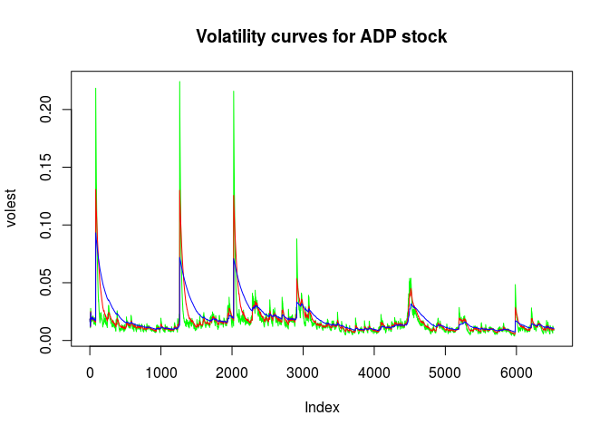
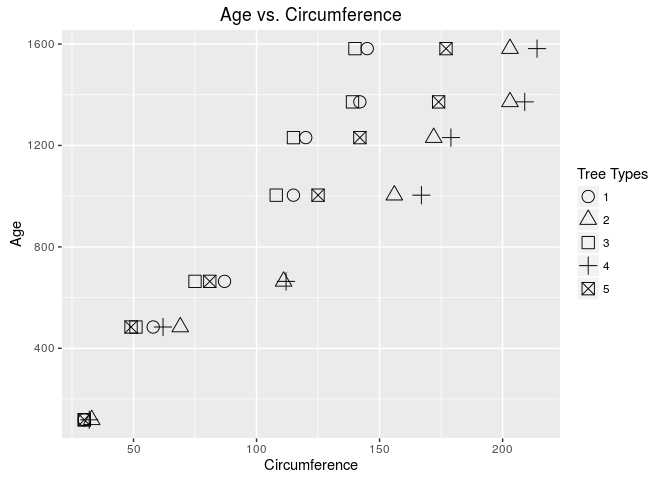
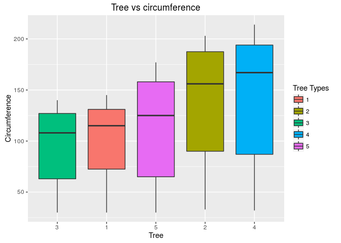

# Case Study 02
contributed by Ramesh and gino  
December 08, 2016  
## Introduction

Case Study 02, final case study.    

* installation and loading of necessary packages              
* R version        
<br>


```r
knitr::opts_chunk$set(echo = TRUE)
require(tseries)
require(ggplot2)
sessionInfo()
```

```
## R version 3.2.3 (2015-12-10)
## Platform: x86_64-pc-linux-gnu (64-bit)
## Running under: Ubuntu 16.04.1 LTS
## 
## locale:
##  [1] LC_CTYPE=en_US.UTF-8       LC_NUMERIC=C              
##  [3] LC_TIME=en_US.UTF-8        LC_COLLATE=en_US.UTF-8    
##  [5] LC_MONETARY=en_US.UTF-8    LC_MESSAGES=en_US.UTF-8   
##  [7] LC_PAPER=en_US.UTF-8       LC_NAME=C                 
##  [9] LC_ADDRESS=C               LC_TELEPHONE=C            
## [11] LC_MEASUREMENT=en_US.UTF-8 LC_IDENTIFICATION=C       
## 
## attached base packages:
## [1] stats     graphics  grDevices utils     datasets  methods   base     
## 
## other attached packages:
## [1] ggplot2_2.1.0   tseries_0.10-35
## 
## loaded via a namespace (and not attached):
##  [1] Rcpp_0.12.7      quadprog_1.5-5   lattice_0.20-33  zoo_1.7-13      
##  [5] digest_0.6.10    assertthat_0.1   plyr_1.8.4       grid_3.2.3      
##  [9] gtable_0.2.0     formatR_1.4      magrittr_1.5     scales_0.4.0    
## [13] evaluate_0.10    stringi_1.1.2    rmarkdown_1.1    tools_3.2.3     
## [17] stringr_1.1.0    munsell_0.4.3    yaml_2.1.13      colorspace_1.2-7
## [21] htmltools_0.3.5  knitr_1.14       tibble_1.2
```

<br>
<br>

### Question 1                                                        
##### Create the X matrix and print it from SAS, R, and Python.                            
<br>

#### SAS Code


```sas
data mylib.Xmatrix;
input x0 x1 x2 x3;
datalines;
4 5 1 2
1 0 3 5
2 1 8 2
;
run;
quit;

Proc IML;
use mylib.Xmatrix;
read all;
x = x0 || x1 || x2 || x3;
print x;
run;
quit;
```

<br>

#### R Code


```r
new_vector <- c(4,5,1,2,1,0,3,5,2,1,8,2)
X <- matrix(new_vector, ncol=4, nrow=3, byrow=TRUE)
X
```

```
##      [,1] [,2] [,3] [,4]
## [1,]    4    5    1    2
## [2,]    1    0    3    5
## [3,]    2    1    8    2
```
<br>

#### Python Code


```python
import numpy as np

new_array = np.array([4,5,1,2,1,0,3,5,2,1,8,2])
new_matrix = np.matrix(new_array)
X = new_matrix.reshape(3,4)
print(X)
```

<br>                  
<br>                

### Question 2                                                        
##### Please do the following with your assigned stock. "ADP" 
<br>

#### Download "ADP" data.

```r
ADP_data <- get.hist.quote('ADP',quote="Close")
```

```
## time series ends   2016-11-25
```
<br>

#### Calculate log returns.                        

```r
ADP_return <- log(lag(ADP_data)) - log(ADP_data)
ADP_volatility <- sd(ADP_return) * sqrt(250) * 100
```
<br>

#### Calculate volatility measure.

```r
getVol <- function(d, log_returns){
  var = 0
  lam = 0
  varlist <- c()

  for (r in log_returns) {
    lam = lam*(1 - 1/d) + 1
    var = (1 - 1/lam)*var + (1/lam)*r^2
    varlist <- c(varlist, var)
  }
  sqrt(varlist)
}
```
<br>

#### Calculate volatility over entire length of series for various three different decay factors.

```r
volest <- getVol(10,ADP_return)
volest2 <- getVol(30,ADP_return)
volest3 <- getVol(100,ADP_return)
```
<br>                

#### Plot the results, overlaying the volatility curves on the data, just as was done in the S&P example.              

```r
plot(volest, type="l", col="green", main="Volatility curves for ADP stock", ylab = "Volitality Estimate")
lines(volest2,type="l",col="red")
lines(volest3, type = "l", col="blue")
```

<!-- -->
<br>  
<br>

### Question 3     
##### The built-in data set called Orange in R is about the growth of orange trees. The Orange data frame has 3 columns of records of the growth of orange trees.                      
<br>

#### a) Calculate the mean and the median of the trunk circumferences for different size of the trees. (Tree)                  

```r
data("Orange")
head(Orange)
```

```
##   Tree  age circumference
## 1    1  118            30
## 2    1  484            58
## 3    1  664            87
## 4    1 1004           115
## 5    1 1231           120
## 6    1 1372           142
```

```r
str(Orange)
```

```
## Classes 'nfnGroupedData', 'nfGroupedData', 'groupedData' and 'data.frame':	35 obs. of  3 variables:
##  $ Tree         : Ord.factor w/ 5 levels "3"<"1"<"5"<"2"<..: 2 2 2 2 2 2 2 4 4 4 ...
##  $ age          : num  118 484 664 1004 1231 ...
##  $ circumference: num  30 58 87 115 120 142 145 33 69 111 ...
##  - attr(*, "formula")=Class 'formula' length 3 circumference ~ age | Tree
##   .. ..- attr(*, ".Environment")=<environment: R_EmptyEnv> 
##  - attr(*, "labels")=List of 2
##   ..$ x: chr "Time since December 31, 1968"
##   ..$ y: chr "Trunk circumference"
##  - attr(*, "units")=List of 2
##   ..$ x: chr "(days)"
##   ..$ y: chr "(mm)"
```

```r
summary(Orange)
```

```
##  Tree       age         circumference  
##  3:7   Min.   : 118.0   Min.   : 30.0  
##  1:7   1st Qu.: 484.0   1st Qu.: 65.5  
##  5:7   Median :1004.0   Median :115.0  
##  2:7   Mean   : 922.1   Mean   :115.9  
##  4:7   3rd Qu.:1372.0   3rd Qu.:161.5  
##        Max.   :1582.0   Max.   :214.0
```

```r
#Mean of circumference by Tree size
orange_mean <- tapply(Orange$circumference,Orange$Tree,mean)
orange_mean[order(names(orange_mean))]
```

```
##         1         2         3         4         5 
##  99.57143 135.28571  94.00000 139.28571 111.14286
```

```r
#Median of circumference by Tree size
orange_median <- tapply(Orange$circumference,Orange$Tree,median)
orange_median[order(names(orange_median))]
```

```
##   1   2   3   4   5 
## 115 156 108 167 125
```
<br>         

#### b) Make a scatter plot of the trunk circumferences against the age of the tree. Use different plotting symbols for different size of trees.                   

```r
is.numeric(Orange$Tree)
```

```
## [1] FALSE
```

```r
is.factor(Orange$Tree)
```

```
## [1] TRUE
```

```r
Orange$order.tree <- as.numeric(as.character(Orange$Tree))

ggplot(data=Orange, aes(x=Orange$circumference, y=Orange$age)) + 
  geom_point(aes(shape = reorder(Orange$Tree,Orange$order.tree)), size=4) +
  scale_shape(name="Tree Types", solid = FALSE) +
  ggtitle("Age vs. Circumference") + xlab("Circumference") + ylab("Age") 
```

<!-- -->
<br>                  

#### c) Display the trunk circumferences on a comparative boxplot against tree. Be sure you order the boxplots in the increasing order of maximum diameter.            

```r
  ggplot(Orange, aes(reorder(Orange$Tree,Orange$circumference) , Orange$circumference, fill = reorder(Orange$Tree,Orange$order.tree))) +  
 geom_boxplot() +
    guides(fill = guide_legend(title = "Tree Types"))+
  ggtitle("Tree vs circumference") +
  xlab("Tree") +  ylab("Circumference")
```

<!-- -->
<br>  
<br>
<br>


