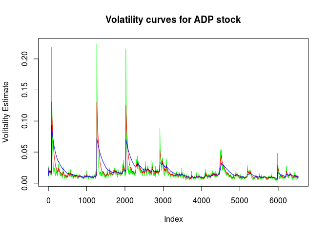
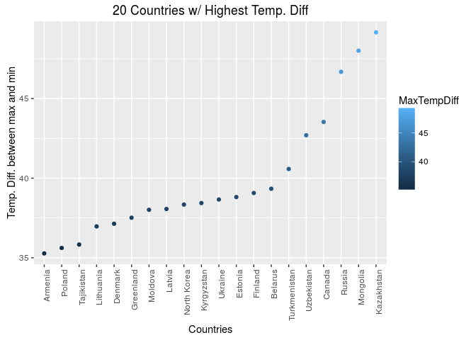

# Case Study 02
contributed by Ramesh and gino  
December 08, 2016  
## Introduction

Case Study 02, final case study.    

* installation and loading of necessary packages              
* R version        
<br>


```r
knitr::opts_chunk$set(echo = TRUE)
knitr::opts_knit$set(root.dir = "~/git/MSDS6306/CaseStudy02/Analysis/Data")
require(tseries)
require(ggplot2)
require(sqldf)
require(lubridate)
require(tcltk)
sessionInfo()
```

```
## R version 3.2.3 (2015-12-10)
## Platform: x86_64-pc-linux-gnu (64-bit)
## Running under: Ubuntu 16.04.1 LTS
## 
## locale:
##  [1] LC_CTYPE=en_US.UTF-8       LC_NUMERIC=C              
##  [3] LC_TIME=en_US.UTF-8        LC_COLLATE=en_US.UTF-8    
##  [5] LC_MONETARY=en_US.UTF-8    LC_MESSAGES=en_US.UTF-8   
##  [7] LC_PAPER=en_US.UTF-8       LC_NAME=C                 
##  [9] LC_ADDRESS=C               LC_TELEPHONE=C            
## [11] LC_MEASUREMENT=en_US.UTF-8 LC_IDENTIFICATION=C       
## 
## attached base packages:
## [1] tcltk     stats     graphics  grDevices utils     datasets  methods  
## [8] base     
## 
## other attached packages:
## [1] lubridate_1.6.0 sqldf_0.4-10    RSQLite_1.1     gsubfn_0.6-6   
## [5] proto_1.0.0     ggplot2_2.1.0   tseries_0.10-35
## 
## loaded via a namespace (and not attached):
##  [1] Rcpp_0.12.7      knitr_1.14       magrittr_1.5     munsell_0.4.3   
##  [5] colorspace_1.2-7 lattice_0.20-33  quadprog_1.5-5   stringr_1.1.0   
##  [9] plyr_1.8.4       tools_3.2.3      grid_3.2.3       gtable_0.2.0    
## [13] DBI_0.5-1        htmltools_0.3.5  yaml_2.1.13      assertthat_0.1  
## [17] digest_0.6.10    tibble_1.2       formatR_1.4      memoise_1.0.0   
## [21] evaluate_0.10    rmarkdown_1.1    stringi_1.1.2    scales_0.4.0    
## [25] chron_2.3-47     zoo_1.7-13
```

<br>
<br>

### Question 1                                                        
##### Create the X matrix and print it from SAS, R, and Python.                            
<br>

#### SAS Code


```sas
data mylib.Xmatrix;
input x0 x1 x2 x3;
datalines;
4 5 1 2
1 0 3 5
2 1 8 2
;
run;
quit;

Proc IML;
use mylib.Xmatrix;
read all;
x = x0 || x1 || x2 || x3;
print x;
run;
quit;
```

<br>

#### R Code


```r
new_vector <- c(4,5,1,2,1,0,3,5,2,1,8,2)
X <- matrix(new_vector, ncol=4, nrow=3, byrow=TRUE)
X
```

```
##      [,1] [,2] [,3] [,4]
## [1,]    4    5    1    2
## [2,]    1    0    3    5
## [3,]    2    1    8    2
```
<br>

#### Python Code


```python
import numpy as np

new_array = np.array([4,5,1,2,1,0,3,5,2,1,8,2])
new_matrix = np.matrix(new_array)
X = new_matrix.reshape(3,4)
print(X)
```

<br>                  
<br>                

### Question 2                                                        
##### Please do the following with your assigned stock. "ADP" 
<br>

#### Download "ADP" data.

```r
ADP_data <- get.hist.quote('ADP',quote="Close")
```

```
## time series ends   2016-11-25
```
<br>

#### Calculate log returns.                        

```r
ADP_return <- log(lag(ADP_data)) - log(ADP_data)
ADP_volatility <- sd(ADP_return) * sqrt(250) * 100
```
<br>

#### Calculate volatility measure.

```r
getVol <- function(d, log_returns){
  var = 0
  lam = 0
  varlist <- c()

  for (r in log_returns) {
    lam = lam*(1 - 1/d) + 1
    var = (1 - 1/lam)*var + (1/lam)*r^2
    varlist <- c(varlist, var)
  }
  sqrt(varlist)
}
```
<br>

#### Calculate volatility over entire length of series for various three different decay factors.

```r
volest <- getVol(10,ADP_return)
volest2 <- getVol(30,ADP_return)
volest3 <- getVol(100,ADP_return)
```
<br>                

#### Plot the results, overlaying the volatility curves on the data, just as was done in the S&P example.              

```r
plot(volest, type="l", col="green", main="Volatility curves for ADP stock", ylab = "Volitality Estimate")
lines(volest2,type="l",col="red")
lines(volest3, type = "l", col="blue")
```

<!-- -->
<br>  
<br>

### Question 3     
##### The built-in data set called Orange in R is about the growth of orange trees. The Orange data frame has 3 columns of records of the growth of orange trees.                      
<br>

#### a) Calculate the mean and the median of the trunk circumferences for different size of the trees. (Tree)                  

```r
data("Orange")
head(Orange)
```

```
##   Tree  age circumference
## 1    1  118            30
## 2    1  484            58
## 3    1  664            87
## 4    1 1004           115
## 5    1 1231           120
## 6    1 1372           142
```

```r
str(Orange)
```

```
## Classes 'nfnGroupedData', 'nfGroupedData', 'groupedData' and 'data.frame':	35 obs. of  3 variables:
##  $ Tree         : Ord.factor w/ 5 levels "3"<"1"<"5"<"2"<..: 2 2 2 2 2 2 2 4 4 4 ...
##  $ age          : num  118 484 664 1004 1231 ...
##  $ circumference: num  30 58 87 115 120 142 145 33 69 111 ...
##  - attr(*, "formula")=Class 'formula' length 3 circumference ~ age | Tree
##   .. ..- attr(*, ".Environment")=<environment: R_EmptyEnv> 
##  - attr(*, "labels")=List of 2
##   ..$ x: chr "Time since December 31, 1968"
##   ..$ y: chr "Trunk circumference"
##  - attr(*, "units")=List of 2
##   ..$ x: chr "(days)"
##   ..$ y: chr "(mm)"
```

```r
summary(Orange)
```

```
##  Tree       age         circumference  
##  3:7   Min.   : 118.0   Min.   : 30.0  
##  1:7   1st Qu.: 484.0   1st Qu.: 65.5  
##  5:7   Median :1004.0   Median :115.0  
##  2:7   Mean   : 922.1   Mean   :115.9  
##  4:7   3rd Qu.:1372.0   3rd Qu.:161.5  
##        Max.   :1582.0   Max.   :214.0
```

```r
#Mean of circumference by Tree size
orange_mean <- tapply(Orange$circumference,Orange$Tree,mean)
orange_mean[order(names(orange_mean))]
```

```
##         1         2         3         4         5 
##  99.57143 135.28571  94.00000 139.28571 111.14286
```

```r
#Median of circumference by Tree size
orange_median <- tapply(Orange$circumference,Orange$Tree,median)
orange_median[order(names(orange_median))]
```

```
##   1   2   3   4   5 
## 115 156 108 167 125
```
<br>         

#### b) Make a scatter plot of the trunk circumferences against the age of the tree. Use different plotting symbols for different size of trees.                   

```r
is.numeric(Orange$Tree)
```

```
## [1] FALSE
```

```r
is.factor(Orange$Tree)
```

```
## [1] TRUE
```

```r
Orange$order.tree <- as.numeric(as.character(Orange$Tree))

ggplot(data=Orange, aes(x=Orange$circumference, y=Orange$age)) + 
  geom_point(aes(shape = reorder(Orange$Tree,Orange$order.tree)), size=4) +
  scale_shape(name="Tree Types", solid = FALSE) +
  ggtitle("Age vs. Circumference") + xlab("Circumference") + ylab("Age") 
```

<!-- -->
<br>                  

#### c) Display the trunk circumferences on a comparative boxplot against tree. Be sure you order the boxplots in the increasing order of maximum diameter.            

```r
  ggplot(Orange, aes(reorder(Orange$Tree,Orange$circumference) , Orange$circumference, fill = reorder(Orange$Tree,Orange$order.tree))) +  
 geom_boxplot() +
    guides(fill = guide_legend(title = "Tree Types"))+
  ggtitle("Tree vs circumference") +
  xlab("Tree") +  ylab("Circumference")
```

<!-- -->
<br>  
<br>

### Question 4     
##### Download “Temp” data set                   
<br>

##### Clean TEMP.csv data to get "Date" into one consistant format

```r
temp_data <- read.csv("TEMP.csv",header=TRUE)
str(temp_data)
```

```
## 'data.frame':	574223 obs. of  4 variables:
##  $ Date                           : Factor w/ 3239 levels "10/1/1900","10/1/1901",..: 1587 1588 1589 1590 1591 1592 1593 1594 1595 1596 ...
##  $ Monthly.AverageTemp            : num  13 NA 23.9 26.9 24.9 ...
##  $ Monthly.AverageTemp.Uncertainty: num  2.59 NA 2.51 2.88 2.99 ...
##  $ Country                        : Factor w/ 242 levels "Afghanistan",..: 1 1 1 1 1 1 1 1 1 1 ...
```

```r
#Any data set that is "NA" has been removed across the board
temp_data <- temp_data[complete.cases(temp_data),]

temp_data$date.clean <- as.Date(temp_data$Date, format = "%Y-%m-%d")
temp_data.sub <- subset(temp_data,is.na(temp_data$date.clean))
temp_data.sub02 <- subset(temp_data,!is.na(temp_data$date.clean))

temp_data.sub$date.clean <- format(dmy(temp_data.sub$Date),"%Y-%m-%d")
temp_data.sub$date.clean <- as.Date(temp_data.sub$date.clean, format = "%Y-%m-%d")


final_temp_data <- rbind(temp_data.sub,temp_data.sub02)

write.csv(final_temp_data,"final_temp_data.csv")

remove(list = ls())

final_temp_data <- read.csv("final_temp_data.csv",header=TRUE)
str(final_temp_data)
```

```
## 'data.frame':	541645 obs. of  6 variables:
##  $ X                              : int  742 743 744 745 746 747 748 749 750 751 ...
##  $ Date                           : Factor w/ 3167 levels "10/1/1900","10/1/1901",..: 227 2256 2370 2484 2598 2712 2826 2940 3054 1 ...
##  $ Monthly.AverageTemp            : num  -3.43 1.23 10.54 13.35 20.26 ...
##  $ Monthly.AverageTemp.Uncertainty: num  0.936 1.135 0.933 0.536 0.524 ...
##  $ Country                        : Factor w/ 241 levels "Afghanistan",..: 1 1 1 1 1 1 1 1 1 1 ...
##  $ date.clean                     : Factor w/ 3167 levels "1743-11-01","1744-04-01",..: 1803 1804 1805 1806 1807 1808 1809 1810 1811 1812 ...
```
<br>

##### (i) Find the difference between the maximum and the minimum monthly average temperatures for each country and report/visualize top 20 countries with the maximum differences for the period since 1900. 

```r
#romve unwanted rows
final_temp_data <- subset(final_temp_data,select = c("Date","Monthly.AverageTemp","Monthly.AverageTemp.Uncertainty","Country","date.clean"))
final_temp_data$date.clean <-  as.Date(final_temp_data$date.clean)
final_temp_data$date.month <- format(as.Date(final_temp_data$date.clean), "%d")
final_temp_data$date.year <- format(as.Date(final_temp_data$date.clean), "%Y")
final_temp_data02 <- subset(final_temp_data,final_temp_data$date.clean > '1900-12-31')
temp_country <- sqldf("SELECT Country, [date.month] AS Month, (max([Monthly.AverageTemp])-min([Monthly.AverageTemp])) AS TempDiff FROM final_temp_data02 Group by Country, [date.month]")
```

```
## Warning: Quoted identifiers should have class SQL, use DBI::SQL() if the
## caller performs the quoting.
```

```r
top20_max_temp <- sqldf("Select src.Country, src.MaxTempDiff From (SELECT Country, max(TempDiff) MaxTempDiff FROM temp_country group by Country) src order by src.MaxTempdiff DESC LIMIT 20")
max_country_temp <- sqldf("Select  tc.Country, tc.Month, tc.TempDiff FROM top20_max_temp as mt inner join temp_country as tc on mt.country = tc.country ")
```
<br>


```r
ggplot(data=max_country_temp, aes(x=max_country_temp$Month, y=max_country_temp$TempDiff , colour =Country)) +
  geom_density(alpha=0.1,position = "stack")+
  ggtitle("20 Countries w/ Highest Temp. Diff. per month") + xlab("Month") + ylab("Temp. Diff. between max and min")
```

<!-- -->

```r
remove(temp_country)
remove(top20_max_temp)
remove(max_country_temp)
```
<br>

##### (ii) Select a subset of data called “UStemp” where US land temperatures from 01/01/1990 in Temp data. Use UStemp dataset to answer the followings.         
<br>


```r
ustemp <- subset(final_temp_data02,(final_temp_data02$Country=="United States") & (final_temp_data02$date.clean > '1990-01-01'))
getfahrenheit <- function(Celsius){
  return(round(((Celsius*(9/5)) + 32), digits = 3))
  }
```
<br>

##### a) Create a new column to display the monthly average land temperatures in Fahrenheit (°F).

```r
ustemp$fahrenheit <- getfahrenheit(ustemp$Monthly.AverageTemp)
str(ustemp)
```

```
## 'data.frame':	284 obs. of  8 variables:
##  $ Date                           : Factor w/ 3167 levels "10/1/1900","10/1/1901",..: 2346 2460 2574 2688 2802 2916 3030 3144 91 204 ...
##  $ Monthly.AverageTemp            : num  -1.75 4.46 9.38 13.77 19.78 ...
##  $ Monthly.AverageTemp.Uncertainty: num  0.107 0.24 0.08 0.112 0.255 0.175 0.218 0.203 0.159 0.3 ...
##  $ Country                        : Factor w/ 241 levels "Afghanistan",..: 232 232 232 232 232 232 232 232 232 232 ...
##  $ date.clean                     : Date, format: "1990-01-02" "1990-01-03" ...
##  $ date.month                     : chr  "02" "03" "04" "05" ...
##  $ date.year                      : chr  "1990" "1990" "1990" "1990" ...
##  $ fahrenheit                     : num  28.9 40 48.9 56.8 67.6 ...
```
<br>

##### b) Calculate average land temperature by year and plot it. The original file has the average land temperature by month.                         

```r
usa_temp_year <- sqldf("SELECT Country, [date.year], avg([Monthly.AverageTemp]) as avgtemp, avg(fahrenheit) as avgtempinF FROM ustemp Group by [date.year]")
```

```
## Warning: Quoted identifiers should have class SQL, use DBI::SQL() if the
## caller performs the quoting.
```

```r
ggplot(usa_temp_year, aes(x=usa_temp_year$date.year, y=usa_temp_year$avgtemp, color=avgtemp) ) +
  geom_point()+
  ggtitle(" Avg. Temp. in U.S.A every year since 1990") + xlab("Year") + ylab("Average Temperature") +
  theme(axis.text.x = element_text(angle = 90, hjust = 1))
```

<!-- -->
<br>

##### c) Calculate the one year difference of average land temperature by year and provide the maximum difference (value) with corresponding two years.                        

<br>


