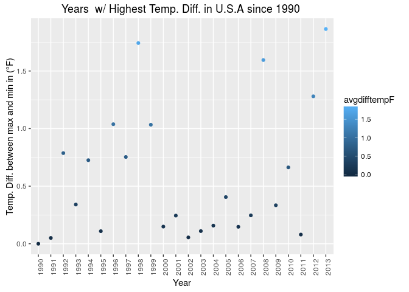

# Case Study 02
contributed by Ramesh and gino  
December 08, 2016  
## Introduction

Case Study 02, final case study.    

* installation and loading of necessary packages              
* R version        
<br>


```r
knitr::opts_chunk$set(echo = TRUE)
knitr::opts_knit$set(root.dir = "~/git/MSDS6306/CaseStudy02/Analysis/Data")
require(tseries)
require(ggplot2)
require(sqldf)
require(lubridate)
require(tcltk)
sessionInfo()
```

```
## R version 3.2.3 (2015-12-10)
## Platform: x86_64-pc-linux-gnu (64-bit)
## Running under: Ubuntu 16.04.1 LTS
## 
## locale:
##  [1] LC_CTYPE=en_US.UTF-8       LC_NUMERIC=C              
##  [3] LC_TIME=en_US.UTF-8        LC_COLLATE=en_US.UTF-8    
##  [5] LC_MONETARY=en_US.UTF-8    LC_MESSAGES=en_US.UTF-8   
##  [7] LC_PAPER=en_US.UTF-8       LC_NAME=C                 
##  [9] LC_ADDRESS=C               LC_TELEPHONE=C            
## [11] LC_MEASUREMENT=en_US.UTF-8 LC_IDENTIFICATION=C       
## 
## attached base packages:
## [1] tcltk     stats     graphics  grDevices utils     datasets  methods  
## [8] base     
## 
## other attached packages:
## [1] lubridate_1.6.0 sqldf_0.4-10    RSQLite_1.1     gsubfn_0.6-6   
## [5] proto_1.0.0     ggplot2_2.1.0   tseries_0.10-35
## 
## loaded via a namespace (and not attached):
##  [1] Rcpp_0.12.7      knitr_1.14       magrittr_1.5     munsell_0.4.3   
##  [5] colorspace_1.2-7 lattice_0.20-33  quadprog_1.5-5   stringr_1.1.0   
##  [9] plyr_1.8.4       tools_3.2.3      grid_3.2.3       gtable_0.2.0    
## [13] DBI_0.5-1        htmltools_0.3.5  yaml_2.1.13      assertthat_0.1  
## [17] digest_0.6.10    tibble_1.2       formatR_1.4      memoise_1.0.0   
## [21] evaluate_0.10    rmarkdown_1.1    stringi_1.1.2    scales_0.4.0    
## [25] chron_2.3-47     zoo_1.7-13
```

<br>
<br>

### Question 1                                                        
#### Create the X matrix and print it from SAS, R, and Python.                            
<br>

#### SAS Code


```sas
data mylib.Xmatrix;
input x0 x1 x2 x3;
datalines;
4 5 1 2
1 0 3 5
2 1 8 2
;
run;
quit;

Proc IML;
use mylib.Xmatrix;
read all;
x = x0 || x1 || x2 || x3;
print x;
run;
quit;
```

<br>

#### R Code


```r
new_vector <- c(4,5,1,2,1,0,3,5,2,1,8,2)
X <- matrix(new_vector, ncol=4, nrow=3, byrow=TRUE)
X
```

```
##      [,1] [,2] [,3] [,4]
## [1,]    4    5    1    2
## [2,]    1    0    3    5
## [3,]    2    1    8    2
```
<br>

#### Python Code


```python
import numpy as np

new_array = np.array([4,5,1,2,1,0,3,5,2,1,8,2])
new_matrix = np.matrix(new_array)
X = new_matrix.reshape(3,4)
print(X)
```

<br>                  
<br>                

### Question 2                                                        
#### Please do the following with your assigned stock. "ADP" 
<br>

#### Download "ADP" data.

```r
ADP_data <- get.hist.quote('ADP',quote="Close")
```

```
## time series ends   2016-11-25
```
<br>

#### Calculate log returns.                        

```r
ADP_return <- log(lag(ADP_data)) - log(ADP_data)
ADP_volatility <- sd(ADP_return) * sqrt(250) * 100
```
<br>

#### Calculate volatility measure.

```r
getVol <- function(d, log_returns){
  var = 0
  lam = 0
  varlist <- c()

  for (r in log_returns) {
    lam = lam*(1 - 1/d) + 1
    var = (1 - 1/lam)*var + (1/lam)*r^2
    varlist <- c(varlist, var)
  }
  sqrt(varlist)
}
```
<br>

#### Calculate volatility over entire length of series for various three different decay factors.

```r
volest <- getVol(10,ADP_return)
volest2 <- getVol(30,ADP_return)
volest3 <- getVol(100,ADP_return)
```
<br>                

#### Plot the results, overlaying the volatility curves on the data, just as was done in the S&P example.              

```r
plot(volest, type="l", col="green", main="Volatility curves for ADP stock", ylab = "Volitality Estimate")
lines(volest2,type="l",col="red")
lines(volest3, type = "l", col="blue")
```

<!-- -->
<br>  
<br>

### Question 3     
#### The built-in data set called Orange in R is about the growth of orange trees. The Orange data frame has 3 columns of records of the growth of orange trees.                      
<br>

#### a) Calculate the mean and the median of the trunk circumferences for different size of the trees. (Tree)                  

```r
data("Orange")
head(Orange)
```

```
##   Tree  age circumference
## 1    1  118            30
## 2    1  484            58
## 3    1  664            87
## 4    1 1004           115
## 5    1 1231           120
## 6    1 1372           142
```

```r
str(Orange)
```

```
## Classes 'nfnGroupedData', 'nfGroupedData', 'groupedData' and 'data.frame':	35 obs. of  3 variables:
##  $ Tree         : Ord.factor w/ 5 levels "3"<"1"<"5"<"2"<..: 2 2 2 2 2 2 2 4 4 4 ...
##  $ age          : num  118 484 664 1004 1231 ...
##  $ circumference: num  30 58 87 115 120 142 145 33 69 111 ...
##  - attr(*, "formula")=Class 'formula' length 3 circumference ~ age | Tree
##   .. ..- attr(*, ".Environment")=<environment: R_EmptyEnv> 
##  - attr(*, "labels")=List of 2
##   ..$ x: chr "Time since December 31, 1968"
##   ..$ y: chr "Trunk circumference"
##  - attr(*, "units")=List of 2
##   ..$ x: chr "(days)"
##   ..$ y: chr "(mm)"
```

```r
summary(Orange)
```

```
##  Tree       age         circumference  
##  3:7   Min.   : 118.0   Min.   : 30.0  
##  1:7   1st Qu.: 484.0   1st Qu.: 65.5  
##  5:7   Median :1004.0   Median :115.0  
##  2:7   Mean   : 922.1   Mean   :115.9  
##  4:7   3rd Qu.:1372.0   3rd Qu.:161.5  
##        Max.   :1582.0   Max.   :214.0
```

```r
#Mean of circumference by Tree size
orange_mean <- tapply(Orange$circumference,Orange$Tree,mean)
orange_mean[order(names(orange_mean))]
```

```
##         1         2         3         4         5 
##  99.57143 135.28571  94.00000 139.28571 111.14286
```

```r
#Median of circumference by Tree size
orange_median <- tapply(Orange$circumference,Orange$Tree,median)
orange_median[order(names(orange_median))]
```

```
##   1   2   3   4   5 
## 115 156 108 167 125
```
<br>         

#### b) Make a scatter plot of the trunk circumferences against the age of the tree. Use different plotting symbols for different size of trees.                   

```r
is.numeric(Orange$Tree)
```

```
## [1] FALSE
```

```r
is.factor(Orange$Tree)
```

```
## [1] TRUE
```

```r
Orange$order.tree <- as.numeric(as.character(Orange$Tree))

ggplot(data=Orange, aes(x=Orange$circumference, y=Orange$age)) + 
  geom_point(aes(shape = reorder(Orange$Tree,Orange$order.tree)), size=4) +
  scale_shape(name="Tree Types", solid = FALSE) +
  ggtitle("Age vs. Circumference") + xlab("Circumference") + ylab("Age") 
```

<!-- -->
<br>                  

#### c) Display the trunk circumferences on a comparative boxplot against tree. Be sure you order the boxplots in the increasing order of maximum diameter.            

```r
  ggplot(Orange, aes(reorder(Orange$Tree,Orange$circumference) , Orange$circumference, fill = reorder(Orange$Tree,Orange$order.tree))) +  
 geom_boxplot() +
    guides(fill = guide_legend(title = "Tree Types"))+
  ggtitle("Tree vs circumference") +
  xlab("Tree") +  ylab("Circumference")
```

<!-- -->
<br>  
<br>

### Question 4     
#### Download “Temp” data set                   
<br>

#### Clean TEMP.csv data to get "Date" into one consistant format, before analysis can begin

```r
#load TEMP.csv file
temp_data <- read.csv("TEMP.csv",header=TRUE)
head(temp_data)
```

```
##         Date Monthly.AverageTemp Monthly.AverageTemp.Uncertainty
## 1 1838-04-01              13.008                           2.586
## 2 1838-05-01                  NA                              NA
## 3 1838-06-01              23.950                           2.510
## 4 1838-07-01              26.877                           2.883
## 5 1838-08-01              24.938                           2.992
## 6 1838-09-01              18.981                           2.538
##       Country
## 1 Afghanistan
## 2 Afghanistan
## 3 Afghanistan
## 4 Afghanistan
## 5 Afghanistan
## 6 Afghanistan
```

```r
#Any data set that is "NA" has been removed across the board
temp_data <- temp_data[complete.cases(temp_data),]

#cleaning up date format
temp_data$date.clean <- as.Date(temp_data$Date, format = "%Y-%m-%d")
temp_data.sub <- subset(temp_data,is.na(temp_data$date.clean))
temp_data.sub02 <- subset(temp_data,!is.na(temp_data$date.clean))
temp_data.sub$date.clean <- format(dmy(temp_data.sub$Date),"%Y-%m-%d")
temp_data.sub$date.clean <- as.Date(temp_data.sub$date.clean, format = "%Y-%m-%d")

#combining the 2 data set
final_temp_data <- rbind(temp_data.sub,temp_data.sub02)

#write to a clean file
write.csv(final_temp_data,"final_temp_data.csv")
remove(list = ls())

#loading a clean file for analysis
final_temp_data <- read.csv("final_temp_data.csv",header=TRUE)
head(final_temp_data)
```

```
##     X     Date Monthly.AverageTemp Monthly.AverageTemp.Uncertainty
## 1 742 1/1/1900              -3.428                           0.936
## 2 743 2/1/1900               1.234                           1.135
## 3 744 3/1/1900              10.545                           0.933
## 4 745 4/1/1900              13.352                           0.536
## 5 746 5/1/1900              20.260                           0.524
## 6 747 6/1/1900              24.448                           0.944
##       Country date.clean
## 1 Afghanistan 1900-01-01
## 2 Afghanistan 1900-01-02
## 3 Afghanistan 1900-01-03
## 4 Afghanistan 1900-01-04
## 5 Afghanistan 1900-01-05
## 6 Afghanistan 1900-01-06
```
<br>

#### (i) Find the difference between the maximum and the minimum monthly average temperatures for each country and report/visualize top 20 countries with the maximum differences for the period since 1900. 

```r
#removing unwanted rows
final_temp_data <- subset(final_temp_data,select = c("Date","Monthly.AverageTemp","Monthly.AverageTemp.Uncertainty","Country","date.clean"))

#verifying date formats
final_temp_data$date.clean <-  as.Date(final_temp_data$date.clean)
final_temp_data$date.month <- format(as.Date(final_temp_data$date.clean), "%d")
final_temp_data$date.year <- format(as.Date(final_temp_data$date.clean), "%Y")

#filtering to data sets > 1900
final_temp_data02 <- subset(final_temp_data,final_temp_data$date.clean > '1900-12-31')

#grouping by country for plot and analysis
temp_country <- sqldf("SELECT Country, (max([Monthly.AverageTemp])) as maxtemp, (min([Monthly.AverageTemp])) as mintemp, (max([Monthly.AverageTemp])) - (min([Monthly.AverageTemp])) as tempdiff  FROM final_temp_data02 Group by Country")
```

```
## Warning: Quoted identifiers should have class SQL, use DBI::SQL() if the
## caller performs the quoting.
```

```r
top20_max_temp <- sqldf("Select src.Country, src.MaxTempDiff From (SELECT Country, max(tempDiff) MaxTempDiff FROM temp_country group by Country) src order by src.MaxTempdiff DESC LIMIT 20")
```
<br>


```r
#filtering data set for United states and date range greater than 1990
ustemp <- subset(final_temp_data02,(final_temp_data02$Country=="United States") & (final_temp_data02$date.clean >= "1990-01-01"))

#plot 01
ggplot(data=top20_max_temp, aes(x=reorder(top20_max_temp$Country,top20_max_temp$MaxTempDiff ), y=top20_max_temp$MaxTempDiff , colour =MaxTempDiff)) +
  geom_point()+
  ggtitle("20 Countries w/ Highest Temp. Diff") + xlab("Countries") + ylab("Temp. Diff. between max and min") +
  theme(axis.text.x = element_text(angle = 90, hjust = 1))
```

<!-- -->
<br>

#### (ii) Select a subset of data called “UStemp” where US land temperatures from 01/01/1990 in Temp data. Use UStemp dataset to answer the followings.         
<br>


```r
#getfahrenheit function takes in celsius and returns fahrenheit
getfahrenheit <- function(Celsius){
  return(round(((Celsius*(9/5)) + 32), digits = 3))
  }
```
<br>

#### a) Create a new column to display the monthly average land temperatures in Fahrenheit (°F).

```r
#converting celsius to fahrenheit
ustemp$fahrenheit <- getfahrenheit(ustemp$Monthly.AverageTemp)
head(ustemp)
```

```
##            Date Monthly.AverageTemp Monthly.AverageTemp.Uncertainty
## 314893 1/1/1990              -1.123                           0.195
## 314894 2/1/1990              -1.747                           0.107
## 314895 3/1/1990               4.465                           0.240
## 314896 4/1/1990               9.380                           0.080
## 314897 5/1/1990              13.772                           0.112
## 314898 6/1/1990              19.780                           0.255
##              Country date.clean date.month date.year fahrenheit
## 314893 United States 1990-01-01         01      1990     29.979
## 314894 United States 1990-01-02         02      1990     28.855
## 314895 United States 1990-01-03         03      1990     40.037
## 314896 United States 1990-01-04         04      1990     48.884
## 314897 United States 1990-01-05         05      1990     56.790
## 314898 United States 1990-01-06         06      1990     67.604
```
<br>

#### b) Calculate average land temperature by year and plot it. The original file has the average land temperature by month.                         

```r
#preparing data set for analysis
usa_temp_year <- sqldf("SELECT Country, [date.year], avg([Monthly.AverageTemp]) as avgtemp, avg(fahrenheit) as avgtempinF FROM ustemp Group by [date.year]")

#plot 02
ggplot(usa_temp_year, aes(x=usa_temp_year$date.year, y=usa_temp_year$avgtempinF, color=avgtempinF) ) +
  geom_point()+
  ggtitle(" Avg. Temp. in U.S.A every year since 1990") + xlab("Year") + ylab("Average Temperature in (°F)") +
  theme(axis.text.x = element_text(angle = 90, hjust = 1))
```

<!-- -->
<br>

#### c) Calculate the one year difference of average land temperature by year and provide the maximum difference (value) with corresponding two years.                        

```r
# temperature (°C)
i=1
tempdiff=numeric(0)
tempdiff=0
  for (i in 2:NROW(usa_temp_year)){
   tempdiff = abs(usa_temp_year[i,]$avgtemp-usa_temp_year[(i-1),]$avgtemp)
  usa_temp_year$avgdifftemp[i] <- tempdiff
  }

usa_temp_year$avgdifftemp[is.na(usa_temp_year$avgdifftemp)] <- 0

# temperature (°F)
i=1
tempdiffF=numeric(0)
tempdiffF=0
  for (i in 2:NROW(usa_temp_year)){
   tempdiffF = abs(usa_temp_year[i,]$avgtempinF-usa_temp_year[(i-1),]$avgtempinF)
  usa_temp_year$avgdifftempF[i] <- tempdiffF
  }

usa_temp_year$avgdifftempF[is.na(usa_temp_year$avgdifftempF)] <- 0

head(usa_temp_year)
```

```
##         Country date.year  avgtemp avgtempinF avgdifftemp avgdifftempF
## 1 United States      1990 9.521583   49.13900  0.00000000   0.00000000
## 2 United States      1991 9.493667   49.08858  0.02791667   0.05041667
## 3 United States      1992 9.056333   48.30150  0.43733333   0.78708333
## 4 United States      1993 8.867250   47.96100  0.18908333   0.34050000
## 5 United States      1994 9.270333   48.68658  0.40308333   0.72558333
## 6 United States      1995 9.331000   48.79583  0.06066667   0.10925000
```
<br>

**Plotting by Year and Temperature Difference in U.S.A**

```r
#plot
ggplot(usa_temp_year, aes(x=usa_temp_year$date.year, y=usa_temp_year$avgdifftempF, color=avgdifftempF) ) +
  geom_point()+
  ggtitle("Years  w/ Highest Temp. Diff. in U.S.A since 1990 ") + xlab("Year") + ylab("Temp. Diff. between max and min in (°F)") +
  theme(axis.text.x = element_text(angle = 90, hjust = 1))
```

<!-- -->

```r
#cleanup before city analysis
remove(list = ls())
```
<br>

#### (iii) Download “CityTemp” data set (check your SMU email). Find the difference between the maximum and the minimum temperatures for each major city and report/visualize top 20 cities with maximum differences for the period since 1900. 

```r
#load city data 
city.temp <- read.csv("CityTemp.csv",header=TRUE)
head(city.temp)
```

```
##         Date Monthly.AverageTemp Monthly.AverageTemp.Uncertainty
## 1 1850-01-01              15.986                           1.537
## 2 1850-02-01              18.345                           1.527
## 3 1850-03-01              18.632                           2.162
## 4 1850-04-01              18.154                           1.693
## 5 1850-05-01              17.480                           1.237
## 6 1850-06-01              17.183                           1.252
##          City  Country Latitude Longitude
## 1 Addis Abeba Ethiopia    8.84N    38.11E
## 2 Addis Abeba Ethiopia    8.84N    38.11E
## 3 Addis Abeba Ethiopia    8.84N    38.11E
## 4 Addis Abeba Ethiopia    8.84N    38.11E
## 5 Addis Abeba Ethiopia    8.84N    38.11E
## 6 Addis Abeba Ethiopia    8.84N    38.11E
```

```r
#Any data set that is "NA" has been removed across the board
city.temp <- city.temp[complete.cases(city.temp),]

#cleaning up date format
city.temp$date.clean <- as.Date(city.temp$Date, format = "%Y-%m-%d")
city.temp.sub <- subset(city.temp,is.na(city.temp$date.clean))
city.temp.sub02 <- subset(city.temp,!is.na(city.temp$date.clean))
city.temp.sub$date.clean <- format(dmy(city.temp.sub$Date),"%Y-%m-%d")
city.temp.sub$date.clean <- as.Date(city.temp.sub$date.clean, format = "%Y-%m-%d")

#combining the 2 data set
final_city_temp <- rbind(city.temp.sub,city.temp.sub02)

#write to a clean file
write.csv(final_city_temp,"final_city_temp.csv")
remove(list = ls())

#loading a clean file for analysis
final_city_temp <- read.csv("final_city_temp.csv",header=TRUE)
head(final_city_temp)
```

```
##     X     Date Monthly.AverageTemp Monthly.AverageTemp.Uncertainty
## 1 601 1/1/1900              17.019                           1.073
## 2 602 2/1/1900              18.153                           0.772
## 3 603 3/1/1900              19.110                           0.954
## 4 604 4/1/1900              19.492                           0.887
## 5 605 5/1/1900              18.353                           2.247
## 6 606 6/1/1900              17.619                           0.948
##          City  Country Latitude Longitude date.clean
## 1 Addis Abeba Ethiopia    8.84N    38.11E 1900-01-01
## 2 Addis Abeba Ethiopia    8.84N    38.11E 1900-01-02
## 3 Addis Abeba Ethiopia    8.84N    38.11E 1900-01-03
## 4 Addis Abeba Ethiopia    8.84N    38.11E 1900-01-04
## 5 Addis Abeba Ethiopia    8.84N    38.11E 1900-01-05
## 6 Addis Abeba Ethiopia    8.84N    38.11E 1900-01-06
```
<br>


```r
#remove unwanted rows

final_city_temp <- subset(final_city_temp,select = c("Date","Monthly.AverageTemp","Monthly.AverageTemp.Uncertainty","City","date.clean"))
final_city_temp$date.clean <-  as.Date(final_city_temp$date.clean)
final_city_temp$date.month <- format(as.Date(final_city_temp$date.clean), "%d")
final_city_temp$date.year <- format(as.Date(final_city_temp$date.clean), "%Y")
final_city_temp02 <- subset(final_city_temp,final_city_temp$date.clean > '1900-12-31')


temp_city <- sqldf("SELECT City, (max([Monthly.AverageTemp])) as maxtemp, (min([Monthly.AverageTemp])) as mintemp, (max([Monthly.AverageTemp])) - (min([Monthly.AverageTemp])) as tempdiff  FROM final_city_temp02 Group by City")
top20_city_temp <- sqldf("Select src.City, src.MaxTempDiff From (SELECT City, max(tempDiff) MaxTempDiff FROM temp_city group by City) src order by src.MaxTempdiff DESC LIMIT 20")
```
<br>

**Plotting Top 20 Cities with Temperature Difference in the world**

```r
ggplot(data=top20_city_temp, aes(x=reorder(top20_city_temp$City,top20_city_temp$MaxTempDiff ), y=top20_city_temp$MaxTempDiff , colour =MaxTempDiff)) +
  geom_point()+
  ggtitle("20 Cities w/ Highest Temp. Diff") + xlab("Cities") + ylab("Temp. Diff. between max and min") +
  theme(axis.text.x = element_text(angle = 90, hjust = 1))
```

<!-- -->

```r
remove(list = ls())
```
<br>

#### (iv) Compare the two graphs in (i) and (iii)  and comment it.

When comparing both the graphs from 4.1 and 4.3, the following can be understood.                          

* The cities from top 20 countires do not make it to the list of the top 20 cities with maximum temperature difference                                      
* While Kazakhstan and Mongolia are top 2 countries with maximum temperature differences, none of the cities made to top 5 of the cities with similar temperature calculations.           
* While China didn’t make to the top 20 countries list, but 3 of China’s cities – Harbin, Changchun, and Shenyang made to top 5 cities list.                                      
* Russia and Canada and their cities made to top 10 in both charts.                                        
                          
There is sufficient evidence to conclude that global warming is prevelant, more so in the northern hemisphere closer to the artic, where countries such as Russia, Canada, Mongolia are affected so are there cities. However overall comparison of temperatures at a Country level and city level, not necessarily apply to all regions within the country. A more detailed analysis at Geographical Region level may be required to evaluate for better conclusions.

<br>
<br>
<br>


