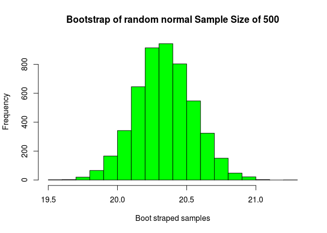
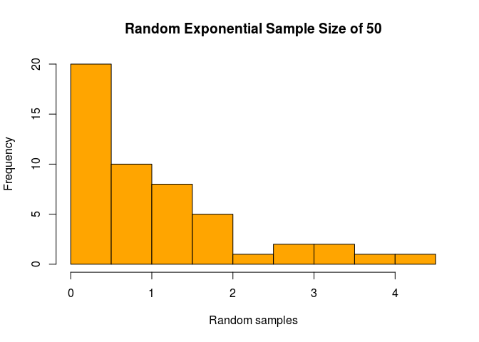

# HomeWork04: Understanding bootstrap
Gino Varghese  
October 22, 2016  


## Homework 04 Instructions      
* Write bootstrap code to illustrate the central limit theorem in R markdown and push the result to GitHub. Use a normal distribution with two different sample sizes and an exponential distribution with two different sample sizes. Correct code alone is insufficient. Please also comment on the code and explain the results. For help, see the lotsa.medians function in Unit 4. The deliverable is a link to a GitHub repo containing the code.           

<br>
<br>

### Functions        

* getNormalDistribution()         
    + Random generation for the normal distribution, requires the number of samples to be generated with a desired mean and standard deviation, by default the mean and standard deviation is set to 0 and 1, returns the normaly distributed samples   
    + getNormalDistribution(n,meanval,sdval)   
    + Parameters:      
        + n = number of sample data to collect      
        + meanval = desired mean     
        + sdval = desired standard deviation   
    + Returns:    
        + getNormalDistributionVal = normal distributed values
    + mean defaults to 0, standard deviation defaults to 1    
<br>
* getExponentialDistribution()         
    + Random generation for the exponential distribution, requires the number of samples to be generated with a desired rate returns exponentially distributed samples      
    + getExponentialDistribution(n,rate)   
    + Parameters:      
        + n = number of sample data to collect      
        + rate = desired rate     
    + Returns:    
        + getExponentialDistributionVal = Exponential distributed samples      
    + rate defaults to 1           
<br>
* getBootstrapMean()            
    + Generates bootstrap mean when [Normal|Exponential] distribution are passed in with desired number of boot strap samples           
    + getBootstrapMean(distribution,bootsamples)          
    + Parameters:        
        + distribution = sample distribution               
        + bootsamples = number of sample data to collect     
    + Returns:    
        + bootmean = BootMeans      
<br>


```r
source("getNormalDistribution.R", echo = TRUE)
```

```
## 
## > getNormalDistribution <- function(n, meanval = 0, 
## +     sdval = 1) {
## +     getNormalDistributionVal <- (rnorm(n, meanval, sdval))
## +     getNormalDi .... [TRUNCATED]
```

```r
source("getExponentialDistribution.R", echo = TRUE)
```

```
## 
## > getExponentialDistribution <- function(n, rate = 1) {
## +     getExponentialDistributionVal <- (rexp(n, rate))
## +     getExponentialDistributionMean <- .... [TRUNCATED]
```

```r
source("getBootstrapMean.R", echo = TRUE)
```

```
## 
## > getBootstrapMean <- function(distribution, bootsamples) {
## +     bootmean <- numeric(bootsamples)
## +     for (i in 1:bootsamples) {
## +         bootsamp .... [TRUNCATED]
```

<br>        

##Setup
##### For this homework, i chose to collect sample size of 50 and 500 for both [random normal & random exponential ] distributions, to understand how samples size perform when they are bootstrapped. I chose to run 5000 bootstrap samples after.     
<br>    

## Normal Distribuiton w. BootStrap 
<br>

* Sample Size of 50, mean of 20 and standard deviation of 5

```
##    Min. 1st Qu.  Median    Mean 3rd Qu.    Max. 
##   11.72   15.65   18.21   19.41   22.82   30.42
```

<!-- -->
                         
                         
                         
<br>      

* Bootstrap of sample size 50

```
##    Min. 1st Qu.  Median    Mean 3rd Qu.    Max. 
##   16.89   18.91   19.41   19.41   19.90   22.10
```

<!-- -->

<br>

```
## [1] "Standard deviation of Random Normal Size 50 :  5.08586263108266"
```

```
## [1] "Standard deviation of Bootstaped samples :  0.724123377698107"
```
The bootstrap samples looks normally distributed, when comparing there standard deviation, we can see that bootstrap samples are closer together than normally distributed samples.

<br>
<br>
<br>

* Sample Size of 500, mean of 20 and standard deviation of 5

```
##    Min. 1st Qu.  Median    Mean 3rd Qu.    Max. 
##   5.464  17.290  20.080  20.340  23.450  35.790
```

<!-- -->

<br>      

* Bootstrap of sample size 500

```
##    Min. 1st Qu.  Median    Mean 3rd Qu.    Max. 
##   19.53   20.20   20.33   20.34   20.48   21.22
```

<!-- -->

<br>

```
## [1] "Standard deviation of Random Normal Size 500 :  4.66585907162542"
```

```
## [1] "Standard deviation of Bootstaped samples :  0.208732052532099"
```
The bootstrap sample looks more normally distributed, when comparing there standard deviation, we can see that bootstrap samples are closer together than normally distributed samples.     

<br>
<br>
<br>


## Exponential Distribuiton w. BootStrap 
<br>

* Sample Size of 50, mean of 20 and standard deviation of 5

```
##     Min.  1st Qu.   Median     Mean  3rd Qu.     Max. 
## 0.001342 0.289300 0.795600 1.069000 1.467000 4.113000
```

<!-- -->
                         
                         
                         
<br>      

* Bootstrap of sample size 50

```
##    Min. 1st Qu.  Median    Mean 3rd Qu.    Max. 
##  0.5625  0.9663  1.0650  1.0690  1.1630  1.6920
```

<!-- -->

<br>

```
## [1] "Standard deviation of Random Exponential Size 50 :  1.0240648631047"
```

```
## [1] "Standard deviation of Bootstaped samples :  0.14530659748677"
```
The bootstrap samples looks normally distributed, when comparing there standard deviation, we can see that bootstrap samples are closer together than normally distributed samples.

<br>
<br>
<br>

* Sample Size of 500, mean of 20 and standard deviation of 5

```
##     Min.  1st Qu.   Median     Mean  3rd Qu.     Max. 
## 0.007818 0.297400 0.666100 0.941300 1.338000 5.288000
```

<!-- -->

<br>      

* Bootstrap of sample size 500

```
##    Min. 1st Qu.  Median    Mean 3rd Qu.    Max. 
##  0.8123  0.9143  0.9413  0.9418  0.9676  1.1160
```

<!-- -->

<br>

```
## [1] "Standard deviation of Random Exponential Size 500 :  0.870032054748161"
```

```
## [1] "Standard deviation of Bootstaped samples :  0.0393884916321746"
```
The bootstrap sample looks more normally distributed, when comparing there standard deviation, we can see that bootstrap samples are closer together than normally distributed samples.         

<br>

## Conclusion:
##### When comparing both bootstrapped samples and random samplles, we can say that the following are true, the bootstrapped samples are normally distributed as per the histogram, the spread of data is smaller when compared to both the distributions. We can say that the effect of the Central Limit Theorem is clearly displayed when comapring the effects of bootstapping on either of the distributions.

