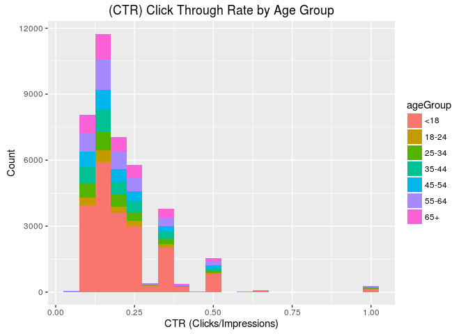
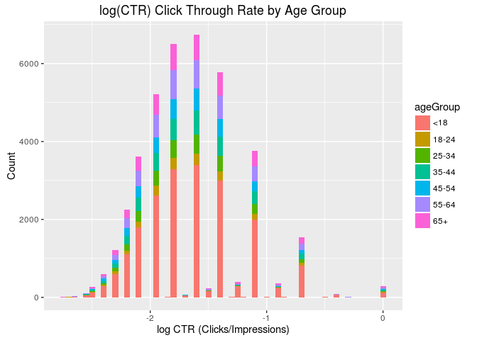
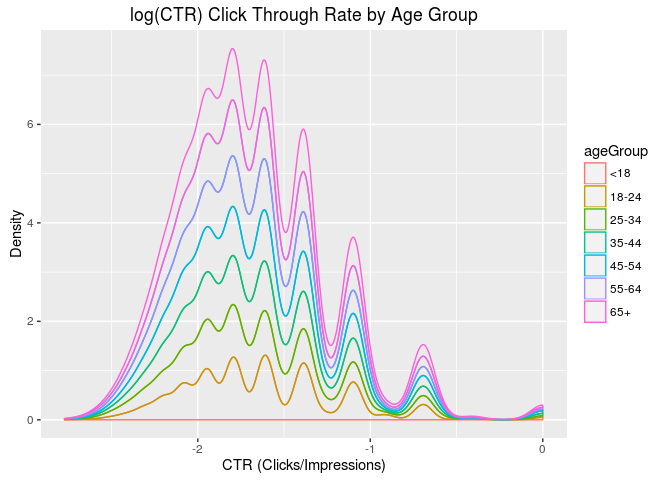
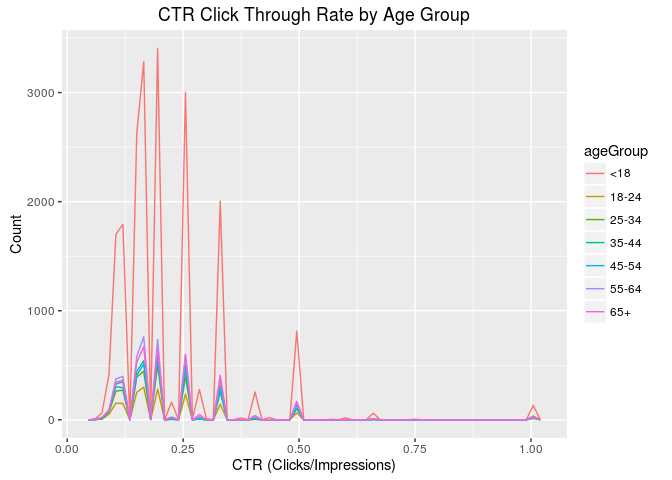

# Live Session Unit 10 Assignment
Gino Varghese  
November 11, 2016  


## Introduction              
Download click through rate data set from the following site   

* http://stat.columbia.edu/~rachel/datasets/nyt7.csv      
and perform necessary analysis to understand days worth of ads shown and clicks recorded on the New York Times homepage in May 2012, for this excercise i will be limiting my analysis to nyt7.csv file.         

<br>

#### The following was done before starting the analysis:                                

* setting of working directory                  
* installation and loading of necessary packages              
* R version     


```r
knitr::opts_chunk$set(echo = TRUE)
knitr::opts_knit$set(root.dir = "~/git/MSDS6306/LiveAssignment_Unit10/Analysis/Data")
require(knitr)
require(dplyr)
require(plyr)
require(ggplot2)
require(downloader)
sessionInfo()
```

```
## R version 3.2.3 (2015-12-10)
## Platform: x86_64-pc-linux-gnu (64-bit)
## Running under: Ubuntu 16.04.1 LTS
## 
## locale:
##  [1] LC_CTYPE=en_US.UTF-8       LC_NUMERIC=C              
##  [3] LC_TIME=en_US.UTF-8        LC_COLLATE=en_US.UTF-8    
##  [5] LC_MONETARY=en_US.UTF-8    LC_MESSAGES=en_US.UTF-8   
##  [7] LC_PAPER=en_US.UTF-8       LC_NAME=C                 
##  [9] LC_ADDRESS=C               LC_TELEPHONE=C            
## [11] LC_MEASUREMENT=en_US.UTF-8 LC_IDENTIFICATION=C       
## 
## attached base packages:
## [1] stats     graphics  grDevices utils     datasets  methods   base     
## 
## other attached packages:
## [1] downloader_0.4 ggplot2_2.1.0  plyr_1.8.4     dplyr_0.5.0   
## [5] knitr_1.14    
## 
## loaded via a namespace (and not attached):
##  [1] Rcpp_0.12.7      digest_0.6.10    assertthat_0.1   grid_3.2.3      
##  [5] R6_2.2.0         gtable_0.2.0     DBI_0.5-1        formatR_1.4     
##  [9] magrittr_1.5     scales_0.4.0     evaluate_0.10    stringi_1.1.2   
## [13] rmarkdown_1.1    tools_3.2.3      stringr_1.1.0    munsell_0.4.3   
## [17] yaml_2.1.13      colorspace_1.2-7 htmltools_0.3.5  tibble_1.2
```
<br>

##### **The analysis was started by downloading the following data sets:**                                

* **download data set nyt7 dataset**         

```r
source("downloadNYT7.R", echo = TRUE)
```

```
## 
## > nyt7url <- "http://stat.columbia.edu/~rachel/datasets/nyt7.csv"
## 
## > download.file(nyt7url, destfile = "nyt7.csv", quiet = TRUE)
```

```r
list.files()
```

```
## [1] "downloadNYT7.R" "nyt7.csv"
```
<br>

##### **Once the data is downloaded to the *Data* directory, its time to load the csv for analysis.**                


```r
filelocation <- "~/git/MSDS6306/LiveAssignment_Unit10/Analysis/Data/nyt7.csv"
nyt7data <- read.csv(filelocation)
```
<br>

##### **Review the data set**         


```r
head(nyt7data)
```

```
##   Age Gender Impressions Clicks Signed_In
## 1   0      0           3      0         0
## 2  46      1           3      0         1
## 3   0      0           6      1         0
## 4  22      0           4      0         1
## 5   0      0           2      0         0
## 6  18      0           6      1         1
```

```r
str(nyt7data)
```

```
## 'data.frame':	452493 obs. of  5 variables:
##  $ Age        : int  0 46 0 22 0 18 0 35 0 41 ...
##  $ Gender     : int  0 1 0 0 0 0 0 0 0 0 ...
##  $ Impressions: int  3 3 6 4 2 6 6 3 3 6 ...
##  $ Clicks     : int  0 0 1 0 0 1 0 1 0 0 ...
##  $ Signed_In  : int  0 1 0 1 0 1 0 1 0 1 ...
```

```r
summary(nyt7data)
```

```
##       Age             Gender        Impressions     Clicks       
##  Min.   :  0.00   Min.   :0.0000   Min.   : 0   Min.   :0.00000  
##  1st Qu.:  0.00   1st Qu.:0.0000   1st Qu.: 3   1st Qu.:0.00000  
##  Median : 31.00   Median :0.0000   Median : 5   Median :0.00000  
##  Mean   : 29.52   Mean   :0.3523   Mean   : 5   Mean   :0.09253  
##  3rd Qu.: 48.00   3rd Qu.:1.0000   3rd Qu.: 6   3rd Qu.:0.00000  
##  Max.   :112.00   Max.   :1.0000   Max.   :19   Max.   :4.00000  
##    Signed_In     
##  Min.   :0.0000  
##  1st Qu.:0.0000  
##  Median :1.0000  
##  Mean   :0.7002  
##  3rd Qu.:1.0000  
##  Max.   :1.0000
```
<br>

##### **Create a new variable *ageGroup* that categorizes age into following groups: < 18, 18–24, 25–34, 35–44, 45–54, 55–64 and 65+.**            


```r
nyt7data$ageGroup <- cut(nyt7data$Age, c(-Inf, 18, 24, 34, 44, 54, 64, Inf))
levels(nyt7data$ageGroup) <- c("<18","18-24","25-34","35-44","45-54","55-64","65+")
levels(nyt7data$ageGroup)
```

```
## [1] "<18"   "18-24" "25-34" "35-44" "45-54" "55-64" "65+"
```

```r
head(nyt7data)
```

```
##   Age Gender Impressions Clicks Signed_In ageGroup
## 1   0      0           3      0         0      <18
## 2  46      1           3      0         1    45-54
## 3   0      0           6      1         0      <18
## 4  22      0           4      0         1    18-24
## 5   0      0           2      0         0      <18
## 6  18      0           6      1         1      <18
```
<br>

##### **Use sub set of data called *ImpSub* where Impressions > 0  in your data set.**


```r
ImpSub <- subset(nyt7data,Impressions > 0)
summary(ImpSub$Impressions)
```

```
##    Min. 1st Qu.  Median    Mean 3rd Qu.    Max. 
##   1.000   3.000   5.000   5.035   6.000  19.000
```
<br>

##### **Create a new variable called click-through-rate (CTR = click/impression).**           

```r
ImpSub$CTR <- ImpSub$Clicks/ImpSub$Impressions
head(ImpSub)
```

```
##   Age Gender Impressions Clicks Signed_In ageGroup       CTR
## 1   0      0           3      0         0      <18 0.0000000
## 2  46      1           3      0         1    45-54 0.0000000
## 3   0      0           6      1         0      <18 0.1666667
## 4  22      0           4      0         1    18-24 0.0000000
## 5   0      0           2      0         0      <18 0.0000000
## 6  18      0           6      1         1      <18 0.1666667
```
<br>

##### **Plot distributions of number impressions and click-through-rate (CTR = click/impression) for the age groups.**
<br>


```r
ggplot(subset(ImpSub,CTR>0), aes(x=CTR, fill = ageGroup)) +
  geom_histogram(binwidth = .05) +
  ggtitle("(CTR) Click Through Rate by Age Group") + xlab("CTR (Clicks/Impressions)") + ylab("Count")
```

<!-- -->
<br>


```r
ggplot(subset(ImpSub,CTR>0), aes(x=log(CTR), fill = ageGroup)) +
  geom_histogram(binwidth = .05) +
  ggtitle("log(CTR) Click Through Rate by Age Group") + xlab("log CTR (Clicks/Impressions)") + ylab("Count")
```

<!-- -->
<br>


```r
ggplot(subset(ImpSub,CTR>0), aes(log(CTR), colour = ageGroup)) +
    geom_density(alpha=0.1,position = "stack") +
  ggtitle("log(CTR) Click Through Rate by Age Group") + xlab("CTR (Clicks/Impressions)") + ylab("Density")
```

<!-- -->
<br>   

##### **Define a new variable to segment users based on click -through-rate (CTR) behavior. CTR< 0.2, 0.2<=CTR <0.4, 0.4<= CTR<0.6, 0.6<=CTR<0.8, CTR>0.8**

```r
ImpSub$CTR.behavior[ImpSub$CTR < 0.2] <- "CTR< 0.2"
ImpSub$CTR.behavior[ImpSub$CTR >= 0.2 &  ImpSub$CTR <0.4] <- "0.2<=CTR <0.4"
ImpSub$CTR.behavior[ImpSub$CTR >= 0.4 &  ImpSub$CTR <0.6] <- "0.4<=CTR <0.6"
ImpSub$CTR.behavior[ImpSub$CTR >= 0.6 &  ImpSub$CTR <0.8] <- "0.6<=CTR <0.8"
ImpSub$CTR.behavior[ImpSub$CTR > 0.8] <- "CTR> 0.4"
```

##### **Get the total number of Male, Impressions, Clicks and Signed_In (0=Female, 1=Male)**

```r
#Gender
sapply(split(ImpSub,ImpSub$Gender),NROW)
```

```
##      0      1 
## 291070 158312
```

```r
#Impressions
sapply(split(ImpSub,ImpSub$Impressions),NROW)
```

```
##     1     2     3     4     5     6     7     8     9    10    11    12 
## 15035 38538 63320 79222 79428 66032 47356 29690 16362  8193  3785  1536 
##    13    14    15    16    17    18    19 
##   577   209    67    22     6     2     2
```

```r
#Clicks
sapply(split(ImpSub,ImpSub$Clicks),NROW)
```

```
##      0      1      2      3      4 
## 410153  36755   2319    143     12
```

```r
#Signed_In
sapply(split(ImpSub,ImpSub$Signed_In),NROW)
```

```
##      0      1 
## 134743 314639
```
<br>

##### **Get the mean of Age, Impressions, Clicks, CTR and percentage of males and signed_In**

```r
#Age
mean(ImpSub$Age)
```

```
## [1] 29.52248
```

```r
#Impressions
mean(ImpSub$Impressions)
```

```
## [1] 5.034732
```

```r
#Clicks
mean(ImpSub$Clicks)
```

```
## [1] 0.0931724
```

```r
#CTR
mean(ImpSub$CTR)
```

```
## [1] 0.01842171
```

```r
#%ofmales
mean(ImpSub$Gender/sum(ImpSub$Gender) *100)
```

```
## [1] 0.0002225278
```

```r
#Signed_In
mean(ImpSub$Signed_In)
```

```
## [1] 0.7001593
```
<br>

##### **Get the means of Impressions, Clicks, CTR and percentage of males and signed_In  by AgeGroup.**

```r
#Impressions
tapply(ImpSub$Impressions,ImpSub$ageGroup,mean)
```

```
##      <18    18-24    25-34    35-44    45-54    55-64      65+ 
## 5.042603 5.022432 5.034145 5.025567 5.027193 5.044342 5.032258
```

```r
#Clicks
tapply(ImpSub$Clicks,ImpSub$ageGroup,mean)
```

```
##        <18      18-24      25-34      35-44      45-54      55-64 
## 0.14324787 0.04927595 0.05010593 0.05040771 0.04969574 0.09972894 
##        65+ 
## 0.15123814
```

```r
#CTR
tapply(ImpSub$CTR,ImpSub$ageGroup,mean)
```

```
##         <18       18-24       25-34       35-44       45-54       55-64 
## 0.028102705 0.009752421 0.010077061 0.010254962 0.009859765 0.019580805 
##         65+ 
## 0.030176711
```

```r
#%ofmales
tapply((ImpSub$Gender/sum(ImpSub$Gender) *100),ImpSub$ageGroup,mean)
```

```
##          <18        18-24        25-34        35-44        45-54 
## 4.866264e-05 3.229719e-04 3.237167e-04 3.222819e-04 3.236898e-04 
##        55-64          65+ 
## 3.213111e-04 2.185415e-04
```

```r
#Signed_In
tapply(ImpSub$Signed_In,ImpSub$ageGroup,mean)
```

```
##       <18     18-24     25-34     35-44     45-54     55-64       65+ 
## 0.1225327 1.0000000 1.0000000 1.0000000 1.0000000 1.0000000 1.0000000
```
<br>

##### **Create a table of CTRGroup vs AgeGroup counts.**

```r
#CTRGroup vs. AgeGroup
ctragegroup <- table(ImpSub$CTR.behavior,ImpSub$ageGroup)
head(ctragegroup)
```

```
##                
##                    <18 18-24 25-34 35-44 45-54 55-64   65+
##   0.2<=CTR <0.4   8885   667  1171  1445  1303  1755  1738
##   0.4<=CTR <0.6   1097    68   108   149   119   186   210
##   0.6<=CTR <0.8     84     1     4     3     3     9    14
##   CTR< 0.2      143361 33712 55332 67169 61659 42293 26555
##   CTR> 0.4         132    11    25    33    20    27    34
```
<br>

##### **One more plot you think which is important to look at.**

```r
ggplot(subset(ImpSub,CTR>0), aes(x=CTR, colour = ageGroup)) +
  geom_freqpoly(binwidth = 0.015) +
  ggtitle("CTR Click Through Rate by Age Group") + xlab("CTR (Clicks/Impressions)") + ylab("Count")
```

<!-- -->
<br>
