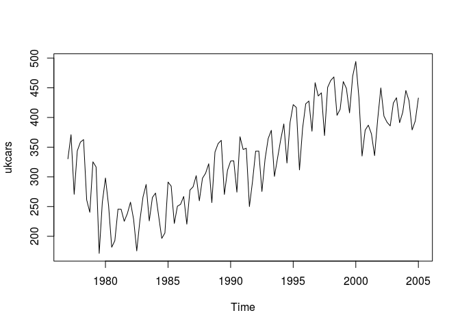
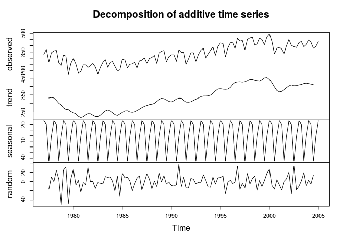
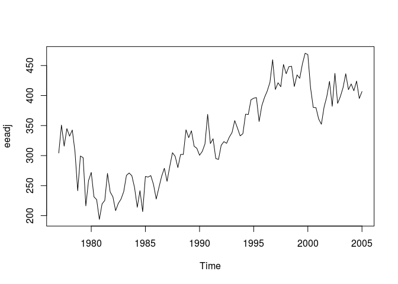
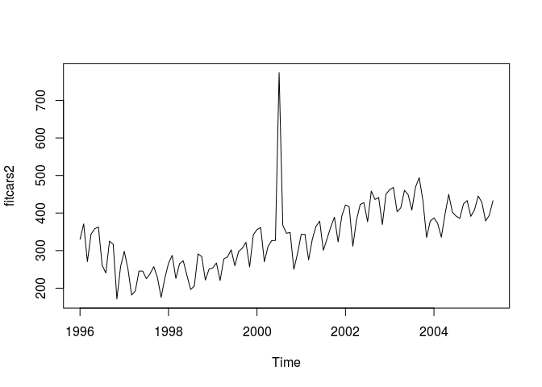
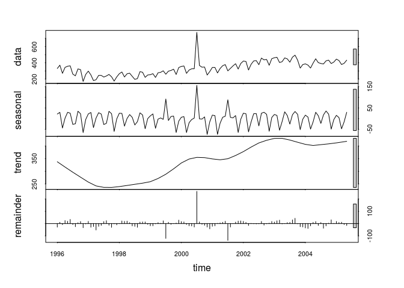
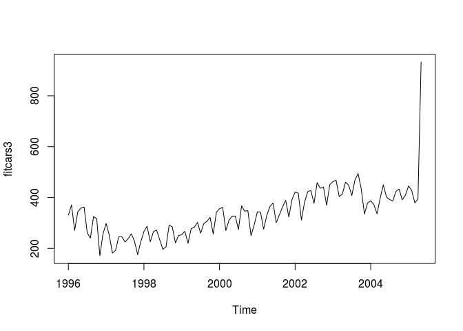
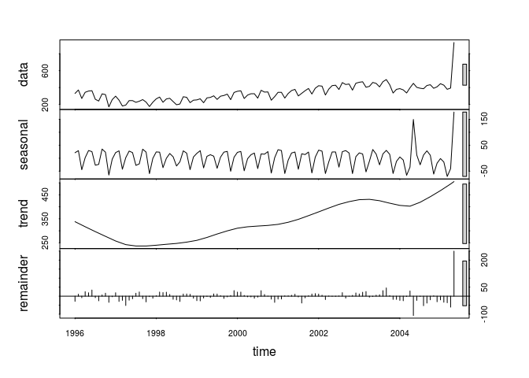
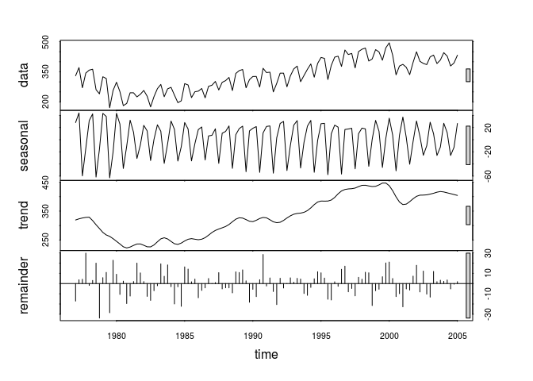
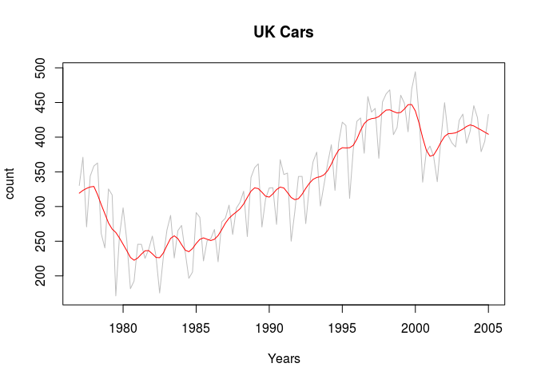

# Live Session Unit 11 Assignment
Gino Varghese  
November 17, 2016  


### Introduction            
<br>

* load libraries

```r
library(fpp)
```

```
## Loading required package: forecast
```

```
## Loading required package: zoo
```

```
## 
## Attaching package: 'zoo'
```

```
## The following objects are masked from 'package:base':
## 
##     as.Date, as.Date.numeric
```

```
## Loading required package: timeDate
```

```
## This is forecast 7.3
```

```
## Loading required package: fma
```

```
## Loading required package: tseries
```

```
## Loading required package: expsmooth
```

```
## Loading required package: lmtest
```

```r
data(ukcars)
```
<br>
<br>

**a) Plot the time series. Can you identify seasonal fluctuations and/or a trend?**            

* We can see seasonal fluctuations and the trend seems seems to go up every year


```r
plot(ukcars)
```

<!-- -->
<br>
<br>

**b) Use a classical decomposition to calculate the trend-cycle and seasonal indices.**              


```r
fitd <- decompose(ukcars)
plot(fitd)
```

<!-- -->
<br>
<br>

**c) Do the results support the graphical interpretation from part (a)?**                 

* Yes, the result from graphical interpretation from part (a) seem to align with the classical decomposition plot.
<br>
<br>


**d) Compute and plot the seasonally adjusted data.**             


```r
eeadj <- seasadj(fitd)
plot(eeadj)
```

<!-- -->
<br>
<br>

**e) Change one observation to be an outlier (e.g., add 500 to one observation), and recompute the seasonally adjusted data. What is the effect of the outlier?**               


```r
fitcars2 <- ts(c(ukcars[1:54],ukcars[55]+500,ukcars[56:113]),start=c(1996,1),frequency=12)
plot(fitcars2)
```

<!-- -->

```r
fit2 <- stl(fitcars2, s.window=5)
plot(fit2)
```

<!-- -->
                                
* The "500" outlier in the middle of the data set has caused a sudden peak in the graph and is in between 2000 and 2002        
* The outlier has caused the seasonal and trend graph to rise up suddenly in middle of the data set
<br>
<br>

**f) Does it make any difference if the outlier is near the end rather than in the middle of the time series?**               


```r
fitcars3 <- ts(c(ukcars[1:112],ukcars[113]+500),start=c(1996,1),frequency=12)
plot(fitcars3)
```

<!-- -->

```r
fit4 <- stl(fitcars3, s.window=5)
plot(fit4)
```

<!-- -->

* The "500" outlier towards the end of the data set has caused a sudden peak in the graph and is after 2004             
* The outlier has caused the seasonal and trend graph to rise up towards the end of the data set, causing the trend to go up higher
<br>
<br>

**g) Use STL to decompose the series.**                                                       

```r
fit <- stl(ukcars, s.window=5)
plot(fit)
```

<!-- -->

```r
plot(ukcars, col="gray",
  main="UK Cars",
  ylab="count", xlab="Years")
lines(fit$time.series[,2],col="red",ylab="Trend")
```

<!-- -->
<br>


